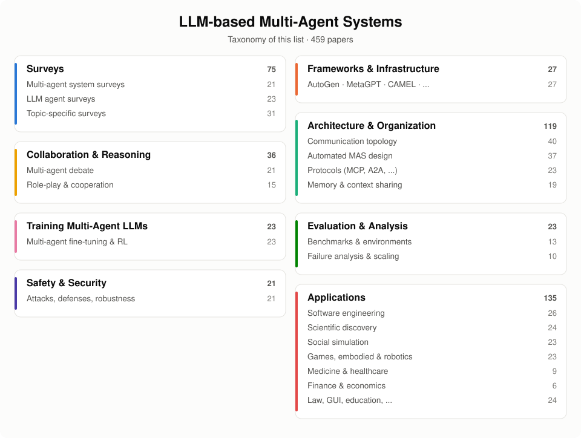
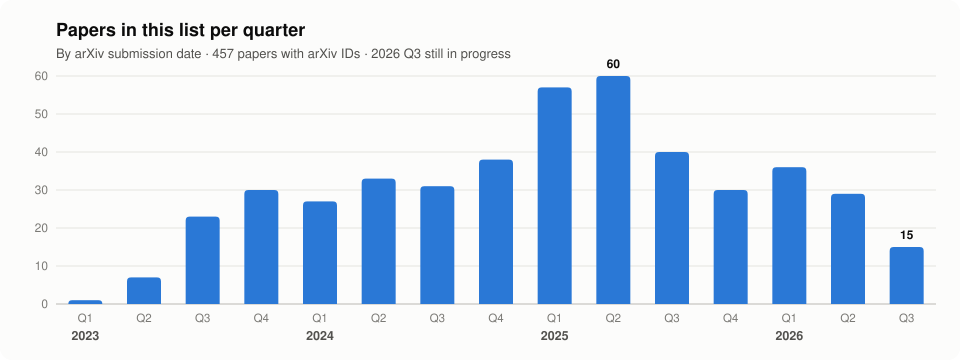

<!-- ⚠️ README.md is AUTO-GENERATED from data/*.yaml by scripts/build_readme.py.
     Edit assets/README.template.md or data/papers.yaml instead. -->
<a id="top"></a>
<div align="center">

# Awesome LLM-based Multi-Agent Systems [](https://awesome.re)

**A curated, continuously updated collection of papers on Large Language Model (LLM)-driven Multi-Agent Systems (MAS).**

[](#-table-of-contents)
[](CONTRIBUTING.md)
[](https://github.com/chen742/Awesome_multi-agent-system/commits)
[](https://github.com/chen742/Awesome_multi-agent-system/stargazers)
[](LICENSE)

**English** | [简体中文](README_zh.md)

</div>

When one LLM is not enough, many LLM agents **talk, debate, divide labor, and self-organize**. This repository tracks the research frontier of LLM-based multi-agent systems — from surveys and frameworks, to communication topologies, automated system design, multi-agent reinforcement learning, benchmarks, failure analysis, safety, and real-world applications.

- 📚 Papers are sorted **newest first** within each category, tagged with `[YYYY/MM]` (arXiv date), venue badge, and code link.
- :star: marks **must-read** papers — start here if you are new to the field.
- 🤝 **Contributions are very welcome!** Found a missing paper? [Open an issue](https://github.com/chen742/Awesome_multi-agent-system/issues/new/choose) or submit a PR — see [CONTRIBUTING.md](CONTRIBUTING.md).

If you find this repository helpful, please give it a ⭐ — it helps more researchers discover it!

## 🔥 News

- **[2026/09]** 🤖 Added one-line TL;DRs (💡) for must-read and recent papers, taxonomy & trend figures, and a daily arXiv watcher that proposes new papers as issues.
- **[2026/09]** 🎉 Repository launched with 459 curated papers across 20+ categories!

## 🗺️ Taxonomy

<p align="center"></p>

## 🌟 Must-Read Papers

New to LLM multi-agent systems? Start with these milestone papers (in chronological order).

- `[2023/03]` **CAMEL: Communicative Agents for "Mind" Exploration of Large Language Model Society**. :star: *Li et al.*  [[Paper](https://arxiv.org/abs/2303.17760)] [[Code](https://github.com/camel-ai/camel)] 
  <br>💡 Introduces role-playing with inception prompting so two agents (AI user and AI assistant) cooperate autonomously on tasks; releases large conversational datasets.
- `[2023/04]` **Generative Agents: Interactive Simulacra of Human Behavior**. :star: *Park et al.*  [[Paper](https://arxiv.org/abs/2304.03442)] [[Code](https://github.com/joonspk-research/generative_agents)] 
  <br>💡 Simulates a small town of 25 agents with memory, reflection and planning, producing believable individual and emergent social behavior.
- `[2023/05]` **Improving Factuality and Reasoning in Language Models through Multiagent Debate**. :star: *Du et al.*  [[Paper](https://arxiv.org/abs/2305.14325)] [[Code](https://github.com/composable-models/llm_multiagent_debate)] 
  <br>💡 Has multiple LLM instances propose and debate answers over several rounds, improving math reasoning and reducing factual hallucinations.
- `[2023/05]` **Encouraging Divergent Thinking in Large Language Models through Multi-Agent Debate**. :star: *Liang et al.*  [[Paper](https://arxiv.org/abs/2305.19118)] [[Code](https://github.com/Skytliang/Multi-Agents-Debate)] 
  <br>💡 Proposes the MAD framework, where agents argue in a tit-for-tat manner and a judge decides, to counter the Degeneration-of-Thought of self-reflection.
- `[2023/07]` **ChatDev: Communicative Agents for Software Development**. :star: *Qian et al.*  [[Paper](https://arxiv.org/abs/2307.07924)] [[Code](https://github.com/OpenBMB/ChatDev)] 
  <br>💡 Builds a virtual software company whose role-playing agents follow a chat chain through design, coding and testing to produce software.
- `[2023/08]` **MetaGPT: Meta Programming for A Multi-Agent Collaborative Framework**. :star: *Hong et al.*  [[Paper](https://arxiv.org/abs/2308.00352)] [[Code](https://github.com/FoundationAgents/MetaGPT)] 
  <br>💡 Encodes human Standardized Operating Procedures into role-specialized agents that exchange structured documents to build software.
- `[2023/08]` **AutoGen: Enabling Next-Gen LLM Applications via Multi-Agent Conversation**. :star: *Wu et al.*  [[Paper](https://arxiv.org/abs/2308.08155)] [[Code](https://github.com/microsoft/autogen)] 
  <br>💡 An open-source framework for building applications from conversable, customizable agents that combine LLMs, humans and tools.
- `[2023/08]` **AgentVerse: Facilitating Multi-Agent Collaboration and Exploring Emergent Behaviors**. :star: *Chen et al.*  [[Paper](https://arxiv.org/abs/2308.10848)] [[Code](https://github.com/OpenBMB/AgentVerse)] 
  <br>💡 A framework that dynamically recruits and adjusts expert agent groups, and studies the emergent social behaviors of agent collaboration.
- `[2023/08]` **A Survey on Large Language Model based Autonomous Agents**. :star: *Lei Wang et al.*  [[Paper](https://arxiv.org/abs/2308.11432)] [[Code](https://github.com/Paitesanshi/LLM-Agent-Survey)] 
  <br>💡 Surveys LLM-based autonomous agents through a unified construction framework (profile, memory, planning, action), applications and evaluation.
- `[2023/09]` **The Rise and Potential of Large Language Model Based Agents: A Survey**. :star: *Zhiheng Xi et al.*  [[Paper](https://arxiv.org/abs/2309.07864)] [[Code](https://github.com/WooooDyy/LLM-Agent-Paper-List)] 
  <br>💡 A comprehensive survey of LLM-based agents, covering the brain-perception-action framework, single/multi-agent and human-agent applications, and agent societies.
- `[2024/02]` **Large Language Model based Multi-Agents: A Survey of Progress and Challenges**. :star: *Guo et al.*  [[Paper](https://arxiv.org/abs/2402.01680)] [[Code](https://github.com/taichengguo/LLM_MultiAgents_Survey_Papers)] 
  <br>💡 Surveys LLM-based multi-agent systems by environment, agent profiling, communication and capability acquisition, across problem solving and world simulation.
- `[2024/02]` **More Agents Is All You Need**. :star: *Li et al.*  [[Paper](https://arxiv.org/abs/2402.05120)] [[Code](https://github.com/MoreAgentsIsAllYouNeed/AgentForest)] 
  <br>💡 Shows that simply sampling many agents and taking a majority vote scales LLM performance with the number of agents.
- `[2024/02]` **GPTSwarm: Language Agents as Optimizable Graphs**. :star: *Zhuge et al.*  [[Paper](https://arxiv.org/abs/2402.16823)] [[Code](https://github.com/metauto-ai/GPTSwarm)] 
  <br>💡 Represents agent systems as computational graphs and automatically optimizes both node prompts and edge connectivity.
- `[2024/06]` **Mixture-of-Agents Enhances Large Language Model Capabilities**. :star: *Wang et al.*  [[Paper](https://arxiv.org/abs/2406.04692)] [[Code](https://github.com/togethercomputer/MoA)] 
  <br>💡 Layers multiple LLMs so each agent refines all outputs of the previous layer, achieving strong results with open-source models only.
- `[2024/06]` **Scaling Large-Language-Model-based Multi-Agent Collaboration**. :star: *Qian et al.*  [[Paper](https://arxiv.org/abs/2406.07155)] [[Code](https://github.com/OpenBMB/ChatDev)] 
  <br>💡 Organizes agents as directed acyclic graphs (MacNet) and finds a collaborative scaling law as the number of agents grows to over a thousand.
- `[2024/08]` **Automated Design of Agentic Systems (ADAS)**. :star: *Shengran Hu et al.*  [[Paper](https://arxiv.org/abs/2408.08435)] [[Code](https://github.com/ShengranHu/ADAS)] 
  <br>💡 Proposes Meta Agent Search, where a meta agent programs new agentic systems in code and iteratively improves them from an archive of discoveries.
- `[2024/10]` **AFlow: Automating Agentic Workflow Generation**. :star: *Jiayi Zhang et al.*  [[Paper](https://arxiv.org/abs/2410.10762)] [[Code](https://github.com/FoundationAgents/AFlow)] 
  <br>💡 Formulates agentic workflow optimization as a search over code-represented workflows and solves it with Monte Carlo Tree Search.
- `[2025/02]` **Multi-agent Architecture Search via Agentic Supernet**. :star: *Zhang et al.*  [[Paper](https://arxiv.org/abs/2502.04180)] [[Code](https://github.com/bingreeky/MaAS)] 
  <br>💡 Optimizes a probabilistic agentic supernet and samples query-dependent multi-agent architectures, improving performance while reducing inference cost.
- `[2025/03]` **MultiAgentBench: Evaluating the Collaboration and Competition of LLM agents**. :star: *Zhu et al.*  [[Paper](https://arxiv.org/abs/2503.01935)] [[Code](https://github.com/ulab-uiuc/MARBLE)] 
  <br>💡 A benchmark (MARBLE) evaluating LLM multi-agent collaboration and competition across diverse interactive scenarios, with milestone-based metrics.
- `[2025/03]` **Why Do Multi-Agent LLM Systems Fail?** :star: *Cemri et al.*  [[Paper](https://arxiv.org/abs/2503.13657)] [[Code](https://github.com/multi-agent-systems-failure-taxonomy/MAST)] 
  <br>💡 Analyzes execution traces of popular MAS frameworks and proposes MAST, a taxonomy of 14 failure modes in three categories.
- `[2025/05]` **Which Agent Causes Task Failures and When? On Automated Failure Attribution of LLM Multi-Agent Systems**. :star: *Zhang et al.*  [[Paper](https://arxiv.org/abs/2505.00212)] [[Code](https://github.com/ag2ai/Agents_Failure_Attribution)] 
  <br>💡 Introduces automated failure attribution, identifying which agent and which step cause a MAS failure, with the Who&When dataset.

## 📊 Statistics

<p align="center"></p>

## 📑 Table of Contents

- [Surveys](#surveys)
  - [LLM-based Multi-Agent System Surveys](#llm-based-multi-agent-system-surveys)
  - [LLM Agent Surveys](#llm-agent-surveys)
  - [Topic-Specific Surveys](#topic-specific-surveys)
- [Frameworks & Infrastructure](#frameworks--infrastructure)
  - [Multi-Agent Frameworks](#multi-agent-frameworks)
- [Architecture & Organization](#architecture--organization)
  - [Communication Topology & Organization Structure](#communication-topology--organization-structure)
  - [Automated MAS Design & Agentic Workflow Optimization](#automated-mas-design--agentic-workflow-optimization)
  - [Agent Communication Protocols & Interoperability](#agent-communication-protocols--interoperability)
  - [Memory & Context Sharing](#memory--context-sharing)
- [Collaboration & Reasoning](#collaboration--reasoning)
  - [Multi-Agent Debate & Collaborative Reasoning](#multi-agent-debate--collaborative-reasoning)
  - [Role-Playing, Cooperation & Social Reasoning](#role-playing-cooperation--social-reasoning)
- [Training Multi-Agent LLMs](#training-multi-agent-llms)
  - [Multi-Agent Fine-Tuning & Reinforcement Learning](#multi-agent-fine-tuning--reinforcement-learning)
- [Evaluation & Analysis](#evaluation--analysis)
  - [Benchmarks & Environments](#benchmarks--environments)
  - [Failure Analysis, Attribution & Scaling](#failure-analysis-attribution--scaling)
- [Safety & Security](#safety--security)
  - [Safety, Security & Robustness](#safety-security--robustness)
- [Applications](#applications)
  - [Software Engineering & Coding](#software-engineering--coding)
  - [Scientific Discovery & Research](#scientific-discovery--research)
  - [Social Simulation & Human Behavior](#social-simulation--human-behavior)
  - [Games, Embodied AI & Robotics](#games-embodied-ai--robotics)
  - [Medicine & Healthcare](#medicine--healthcare)
  - [Finance & Economics](#finance--economics)
  - [Other Domains](#other-domains)
- [Related Awesome Lists](#-related-awesome-lists)
- [Contributing](#-contributing)
- [Star History](#-star-history)

<!-- BEGIN GENERATED -->

## Surveys

> Surveys, reviews and position papers — the best place to start.

### LLM-based Multi-Agent System Surveys

- `[2026/07]` **Multi-Agent Debate Strategies: Survey, Taxonomy, and Challenges**. *Quim Motger et al.*  [[Paper](https://arxiv.org/abs/2607.26212)]
  <br>💡 Surveys 141 multi-agent debate studies with a taxonomy of participants, interaction mechanisms and agreement protocols, noting convergence on a narrow design pattern.
- `[2026/05]` **Beyond Individual Intelligence: Surveying Collaboration, Failure Attribution, and Self-Evolution in LLM-based Multi-Agent Systems**. *Shihao Qi et al.*  [[Paper](https://arxiv.org/abs/2605.14892)]
  <br>💡 Surveys LLM-based multi-agent systems along a LIFE progression covering capability foundations, collaboration, failure attribution and self-evolution.
- `[2026/05]` **Reinforcement Learning for LLM-based Multi-Agent Systems through Orchestration Traces**. *Chenchen Zhang*.  [[Paper](https://arxiv.org/abs/2605.02801)]
  <br>💡 Surveys reinforcement learning for LLM multi-agent systems through orchestration traces, covering reward design, credit assignment and spawn, delegate, communicate, aggregate and stop decisions.
- `[2026/04]` **Multi-Agent Systems: From Classical Paradigms to Large Foundation Model-Enabled Futures**. *Zixiang Wang et al.*  [[Paper](https://arxiv.org/abs/2604.18133)]
  <br>💡 Surveys multi-agent systems from classical paradigms to large foundation model-based ones, comparing them across perception, communication, decision-making and control.
- `[2026/02]` **Towards a Science of Collective AI: LLM-based Multi-Agent Systems Need a Transition from Blind Trial-and-Error to Rigorous Science**. *Jingru Fan et al.*  [[Paper](https://arxiv.org/abs/2602.05289)]
- `[2026/01]` **Game-Theoretic Lens on LLM-based Multi-Agent Systems**. *Jianing Hao et al.*  [[Paper](https://arxiv.org/abs/2601.15047)]
- `[2025/05]` **Creativity in LLM-based Multi-Agent Systems: A Survey**. *Yi-Cheng Lin et al.*  [[Paper](https://arxiv.org/abs/2505.21116)]
- `[2025/05]` **A Survey on Large Language Model based Human-Agent Systems**. *Henry Peng Zou et al.*  [[Paper](https://arxiv.org/abs/2505.00753)] [[Code](https://github.com/HenryPengZou/Awesome-LLM-Based-Human-Agent-System-Papers)] 
- `[2025/04]` **Meta-Thinking in LLMs via Multi-Agent Reinforcement Learning: A Survey**. *Bilal et al.*  [[Paper](https://arxiv.org/abs/2504.14520)]
- `[2025/04]` **LLMs Working in Harmony: A Survey on the Technological Aspects of Building Effective LLM-Based Multi Agent Systems**. *R. M. Aratchige et al.*  [[Paper](https://arxiv.org/abs/2504.01963)]
- `[2025/03]` **A Comprehensive Survey on Multi-Agent Cooperative Decision-Making: Scenarios, Approaches, Challenges and Perspectives**. *Weiqiang Jin et al.*  [[Paper](https://arxiv.org/abs/2503.13415)]
- `[2025/02]` **Multi-Agent Coordination across Diverse Applications: A Survey**. *Lijun Sun et al.*  [[Paper](https://arxiv.org/abs/2502.14743)]
- `[2025/01]` **Multi-Agent Collaboration Mechanisms: A Survey of LLMs**. *Tran et al.*  [[Paper](https://arxiv.org/abs/2501.06322)]
- `[2024/12]` **A Survey on LLM-based Multi-Agent System: Recent Advances and New Frontiers in Application**. *Shuaihang Chen et al.*  [[Paper](https://arxiv.org/abs/2412.17481)]
- `[2024/12]` **A Survey on Large Language Model-Based Social Agents in Game-Theoretic Scenarios**. *Feng et al.*  [[Paper](https://arxiv.org/abs/2412.03920)]
- `[2024]` **A Survey on LLM-based Multi-Agent Systems: Workflow, Infrastructure, and Challenges**. *Xinyi Li et al.*  [[Paper](https://link.springer.com/article/10.1007/s44336-024-00009-2)]
- `[2024/11]` **LLM-based Multi-Agent Systems: Techniques and Business Perspectives**. *Yingxuan Yang et al.*  [[Paper](https://arxiv.org/abs/2411.14033)]
- `[2024/05]` **LLM-based Multi-Agent Reinforcement Learning: Current and Future Directions**. *Chuanneng Sun et al.*  [[Paper](https://arxiv.org/abs/2405.11106)]
- `[2024/02]` **LLM Multi-Agent Systems: Challenges and Open Problems**. *Shanshan Han et al.*  [[Paper](https://arxiv.org/abs/2402.03578)]
- `[2024/02]` **Large Language Model based Multi-Agents: A Survey of Progress and Challenges**. :star: *Guo et al.*  [[Paper](https://arxiv.org/abs/2402.01680)] [[Code](https://github.com/taichengguo/LLM_MultiAgents_Survey_Papers)] 
  <br>💡 Surveys LLM-based multi-agent systems by environment, agent profiling, communication and capability acquisition, across problem solving and world simulation.
- `[2023/10]` **Balancing Autonomy and Alignment: A Multi-Dimensional Taxonomy for Autonomous LLM-powered Multi-Agent Architectures**. *Thorsten Händler*.  [[Paper](https://arxiv.org/abs/2310.03659)]

<p align="right">(<a href="#top">back to top</a>)</p>

### LLM Agent Surveys

- `[2026/02]` **A Survey of Agent Memory in the Second Half: Towards Self-Evolving and Long-Horizon Agents**. *Wei-Chieh Huang et al.*  [[Paper](https://arxiv.org/abs/2602.06052)]
- `[2026/01]` **Agentic Reasoning for Large Language Models**. *Tianxin Wei et al.*  [[Paper](https://arxiv.org/abs/2601.12538)] [[Code](https://github.com/weitianxin/Awesome-Agentic-Reasoning)] 
- `[2025/12]` **Memory in the Age of AI Agents**. *Yuyang Hu et al.*  [[Paper](https://arxiv.org/abs/2512.13564)] [[Code](https://github.com/Shichun-Liu/Agent-Memory-Paper-List)] 
- `[2025/09]` **LLM-based Agents Suffer from Hallucinations: A Survey of Taxonomy, Methods, and Directions**. *Xixun Lin et al.*  [[Paper](https://arxiv.org/abs/2509.18970)]
- `[2025/09]` **The Landscape of Agentic Reinforcement Learning for LLMs: A Survey**. *Guibin Zhang et al.*  [[Paper](https://arxiv.org/abs/2509.02547)] [[Code](https://github.com/xhyumiracle/Awesome-AgenticLLM-RL-Papers)] 
- `[2025/08]` **A Comprehensive Survey of Self-Evolving AI Agents: A New Paradigm Bridging Foundation Models and Lifelong Agentic Systems**. *Jinyuan Fang et al.*  [[Paper](https://arxiv.org/abs/2508.07407)] [[Code](https://github.com/EvoAgentX/Awesome-Self-Evolving-Agents)] 
- `[2025/08]` **A Survey on Agent Workflow -- Status and Future**. *Chaojia Yu et al.*  [[Paper](https://arxiv.org/abs/2508.01186)]
- `[2025/07]` **A Survey of Self-Evolving Agents: What, When, How, and Where to Evolve on the Path to Artificial Super Intelligence**. *Huan-ang Gao et al.*  [[Paper](https://arxiv.org/abs/2507.21046)] [[Code](https://github.com/CharlesQ9/Self-Evolving-Agents)] 
- `[2025/05]` **AI Agents vs. Agentic AI: A Conceptual Taxonomy, Applications and Challenges**. *Ranjan Sapkota et al.*  [[Paper](https://arxiv.org/abs/2505.10468)]
- `[2025/04]` **A Survey of Frontiers in LLM Reasoning: Inference Scaling, Learning to Reason, and Agentic Systems**. *Zixuan Ke et al.*  [[Paper](https://arxiv.org/abs/2504.09037)]
- `[2025/04]` **Advances and Challenges in Foundation Agents: From Brain-Inspired Intelligence to Evolutionary, Collaborative, and Safe Systems**. *Bang Liu et al.*  [[Paper](https://arxiv.org/abs/2504.01990)] [[Code](https://github.com/FoundationAgents/awesome-foundation-agents)] 
- `[2025/03]` **Agentic Large Language Models, a Survey**. *Aske Plaat et al.*  [[Paper](https://arxiv.org/abs/2503.23037)]
- `[2025/03]` **Large Language Model Agent: A Survey on Methodology, Applications and Challenges**. *Junyu Luo et al.*  [[Paper](https://arxiv.org/abs/2503.21460)] [[Code](https://github.com/luo-junyu/Awesome-Agent-Papers)] 
- `[2025/02]` **Position: Stop Acting Like Language Model Agents Are Normal Agents**. *Elija Perrier et al.*  [[Paper](https://arxiv.org/abs/2502.10420)]
- `[2024/09]` **Large Model Based Agents: State-of-the-Art, Cooperation Paradigms, Security and Privacy, and Future Trends**. *Yuntao Wang et al.*  [[Paper](https://arxiv.org/abs/2409.14457)]
- `[2024/06]` **A Review of Prominent Paradigms for LLM-Based Agents: Tool Use (Including RAG), Planning, and Feedback Learning**. *Xinzhe Li*.  [[Paper](https://arxiv.org/abs/2406.05804)] [[Code](https://github.com/xinzhel/LLM-Agent-Survey)] 
- `[2024/04]` **A Survey on the Memory Mechanism of Large Language Model based Agents**. *Zeyu Zhang et al.*  [[Paper](https://arxiv.org/abs/2404.13501)] [[Code](https://github.com/nuster1128/LLM_Agent_Memory_Survey)] 
- `[2024/04]` **The Landscape of Emerging AI Agent Architectures for Reasoning, Planning, and Tool Calling: A Survey**. *Tula Masterman et al.*  [[Paper](https://arxiv.org/abs/2404.11584)]
- `[2024/02]` **Understanding the Planning of LLM Agents: A Survey**. *Xu Huang et al.*  [[Paper](https://arxiv.org/abs/2402.02716)]
- `[2024/01]` **Agent AI: Surveying the Horizons of Multimodal Interaction**. *Zane Durante et al.*  [[Paper](https://arxiv.org/abs/2401.03568)]
- `[2023/09]` **An In-depth Survey of Large Language Model-based Artificial Intelligence Agents**. *Pengyu Zhao et al.*  [[Paper](https://arxiv.org/abs/2309.14365)]
- `[2023/09]` **The Rise and Potential of Large Language Model Based Agents: A Survey**. :star: *Zhiheng Xi et al.*  [[Paper](https://arxiv.org/abs/2309.07864)] [[Code](https://github.com/WooooDyy/LLM-Agent-Paper-List)] 
  <br>💡 A comprehensive survey of LLM-based agents, covering the brain-perception-action framework, single/multi-agent and human-agent applications, and agent societies.
- `[2023/08]` **A Survey on Large Language Model based Autonomous Agents**. :star: *Lei Wang et al.*  [[Paper](https://arxiv.org/abs/2308.11432)] [[Code](https://github.com/Paitesanshi/LLM-Agent-Survey)] 
  <br>💡 Surveys LLM-based autonomous agents through a unified construction framework (profile, memory, planning, action), applications and evaluation.

<p align="right">(<a href="#top">back to top</a>)</p>

### Topic-Specific Surveys

- `[2026/09]` **SoK: When Safe Agents Fail Together: The Security of Multi Agent LLM Systems**. *Rui Yang et al.*  [[Paper](https://arxiv.org/abs/2609.00595)]
  <br>💡 Systematizes multi-agent LLM system security across 197 works with an adversary-interface-risk framework and a five-part contract for organizing defenses.
- `[2026/06]` **A Technical Taxonomy of LLM Agent Communication Protocols**. *Linus Sander et al.*  [[Paper](https://arxiv.org/abs/2606.19135)]
  <br>💡 Develops a five-dimension taxonomy of LLM agent communication protocols covering counterparty, payload, interaction state, discovery mechanism and schema flexibility.
- `[2026/04]` **A Systematic Survey of Security Threats and Defenses in LLM-Based AI Agents: A Layered Attack Surface Framework**. *Kexin Chu*.  [[Paper](https://arxiv.org/abs/2604.23338)]
  <br>💡 Surveys LLM agent security threats and defenses with a seven-layer attack surface model plus a temporality axis, finding upper layers under-explored.
- `[2025/07]` **Evaluation and Benchmarking of LLM Agents: A Survey**. *Mahmoud Mohammadi et al.*  [[Paper](https://arxiv.org/abs/2507.21504)]
- `[2025/06]` **Evolutionary Perspectives on the Evaluation of LLM-Based AI Agents: A Comprehensive Survey**. *Jiachen Zhu et al.*  [[Paper](https://arxiv.org/abs/2506.11102)]
- `[2025/06]` **Survey of LLM Agent Communication with MCP: A Software Design Pattern Centric Review**. *Anjana Sarkar et al.*  [[Paper](https://arxiv.org/abs/2506.05364)]
- `[2025/06]` **TRiSM for Agentic AI: A Review of Trust, Risk, and Security Management in LLM-based Agentic Multi-Agent Systems**. *Shaina Raza et al.*  [[Paper](https://arxiv.org/abs/2506.04133)]
- `[2025/05]` **Internet of Agents: Fundamentals, Applications, and Challenges**. *Yuntao Wang et al.*  [[Paper](https://arxiv.org/abs/2505.07176)]
- `[2025/05]` **A Survey of Agent Interoperability Protocols: Model Context Protocol (MCP), Agent Communication Protocol (ACP), Agent-to-Agent Protocol (A2A), and Agent Network Protocol (ANP)**. *Abul Ehtesham et al.*  [[Paper](https://arxiv.org/abs/2505.02279)]
- `[2025/05]` **Open Challenges in Multi-Agent Security: Towards Secure Systems of Interacting AI Agents**. *Schroeder de Witt et al.*  [[Paper](https://arxiv.org/abs/2505.02077)]
- `[2025/04]` **A Survey of AI Agent Protocols**. *Yingxuan Yang et al.*  [[Paper](https://arxiv.org/abs/2504.16736)]
- `[2025/04]` **A Comprehensive Survey in LLM(-Agent) Full Stack Safety: Data, Training and Deployment**. *Kun Wang et al.*  [[Paper](https://arxiv.org/abs/2504.15585)]
- `[2025/03]` **Towards Scientific Intelligence: A Survey of LLM-based Scientific Agents**. *Shuo Ren et al.*  [[Paper](https://arxiv.org/abs/2503.24047)]
- `[2025/03]` **Model Context Protocol (MCP): Landscape, Security Threats, and Future Research Directions**. *Hou et al.*  [[Paper](https://arxiv.org/abs/2503.23278)] [[Code](https://github.com/security-pride/MCP_Landscape)] 
- `[2025/03]` **Evaluating LLM-based Agents for Multi-Turn Conversations: A Survey**. *Shengyue Guan et al.*  [[Paper](https://arxiv.org/abs/2503.22458)]
- `[2025/03]` **Survey on Evaluation of LLM-based Agents**. *Asaf Yehudai et al.*  [[Paper](https://arxiv.org/abs/2503.16416)]
- `[2025/03]` **A Survey on Trustworthy LLM Agents: Threats and Countermeasures**. *Miao Yu et al.*  [[Paper](https://arxiv.org/abs/2503.09648)]
- `[2025/03]` **Agentic AI for Scientific Discovery: A Survey of Progress, Challenges, and Future Directions**. *Mourad Gridach et al.*  [[Paper](https://arxiv.org/abs/2503.08979)]
- `[2025/02]` **Beyond Self-Talk: A Communication-Centric Survey of LLM-Based Multi-Agent Systems**. *Bingyu Yan et al.*  [[Paper](https://arxiv.org/abs/2502.14321)]
- `[2025/02]` **Multi-Agent Risks from Advanced AI**. *Hammond et al.*  [[Paper](https://arxiv.org/abs/2502.14143)]
- `[2025/02]` **A Survey of LLM-based Agents in Medicine: How far are we from Baymax?** *Wenxuan Wang et al.*  [[Paper](https://arxiv.org/abs/2502.11211)]
- `[2025/02]` **Position: Towards a Responsible LLM-empowered Multi-Agent Systems**. *Jinwei Hu et al.*  [[Paper](https://arxiv.org/abs/2502.01714)]
- `[2025/01]` **Agentic Retrieval-Augmented Generation: A Survey on Agentic RAG**. *Aditi Singh et al.*  [[Paper](https://arxiv.org/abs/2501.09136)]
- `[2024/12]` **From Individual to Society: A Survey on Social Simulation Driven by Large Language Model-based Agents**. *Xinyi Mou et al.*  [[Paper](https://arxiv.org/abs/2412.03563)] [[Code](https://github.com/FudanDISC/SocialAgent)] 
- `[2024/11]` **Large Language Model-Brained GUI Agents: A Survey**. *Chaoyun Zhang et al.*  [[Paper](https://arxiv.org/abs/2411.18279)]
- `[2024/11]` **Navigating the Risks: A Survey of Security, Privacy, and Ethics Threats in LLM-Based Agents**. *Yuyou Gan et al.*  [[Paper](https://arxiv.org/abs/2411.09523)]
- `[2024/09]` **Agents in Software Engineering: Survey, Landscape, and Vision**. *Yanlin Wang et al.*  [[Paper](https://arxiv.org/abs/2409.09030)]
- `[2024/09]` **Large Language Model-Based Agents for Software Engineering: A Survey**. *Junwei Liu et al.*  [[Paper](https://arxiv.org/abs/2409.02977)]
- `[2024/07]` **The Emerged Security and Privacy of LLM Agent: A Survey with Case Studies**. *Feng He et al.*  [[Paper](https://arxiv.org/abs/2407.19354)]
- `[2024/04]` **A Survey on Large Language Model-Based Game Agents**. *Sihao Hu et al.*  [[Paper](https://arxiv.org/abs/2404.02039)]
- `[2023/12]` **Large Language Models Empowered Agent-based Modeling and Simulation: A Survey and Perspectives**. *Chen Gao et al.*  [[Paper](https://arxiv.org/abs/2312.11970)]

<p align="right">(<a href="#top">back to top</a>)</p>

## Frameworks & Infrastructure

> General-purpose platforms and frameworks for building LLM multi-agent systems.

### Multi-Agent Frameworks

- `[2026/09]` **Agensh: Scaling Organizational Intelligence to 1,024 Agents**. *Zhihao Zhan et al.*  [[Paper](https://arxiv.org/abs/2609.26781)]
  <br>💡 Presents Agensh, an orchestrator-free multi-agent harness where workers self-assign tasks via a shared workspace, message bus and shared context, scaling coding collaboration to 1,024 agents.
- `[2026/05]` **PatchBoard: Schema-Grounded State Mutation for Reliable and Auditable LLM Multi-Agent Collaboration**. *Shuyu Zhang et al.*  [[Paper](https://arxiv.org/abs/2605.29313)]
  <br>💡 Proposes PatchBoard, which replaces free-form inter-agent dialogue with schema-validated JSON Patch mutations over shared state, making multi-agent collaboration reliable, attributable and auditable.
- `[2026/02]` **Declarative by Design, Assistable Only by Convention: Benchmarking Multi-Agent Frameworks for AI-Assistability**. *Shafiuddin Rehan Ahmed et al.*  [[Paper](https://arxiv.org/abs/2602.11198)]
- `[2025/11]` **The OpenHands Software Agent SDK: A Composable and Extensible Foundation for Production Agents**. *Xingyao Wang et al.*  [[Paper](https://arxiv.org/abs/2511.03690)] [[Code](https://github.com/OpenHands/software-agent-sdk)] 
- `[2025/11]` **A Comprehensive Empirical Evaluation of Agent Frameworks**. *Zhuowen Yin et al.*  [[Paper](https://arxiv.org/abs/2511.00872)]
- `[2025/08]` **Anemoi: A Semi-Centralized Multi-agent System Based on Agent-to-Agent Communication MCP server from Coral Protocol**. *Xinxing Ren et al.*  [[Paper](https://arxiv.org/abs/2508.17068)] [[Code](https://github.com/Coral-Protocol/Anemoi)] 
- `[2025/08]` **AgentScope 1.0: A Developer-Centric Framework for Building Agentic Applications**. *Dawei Gao et al.*  [[Paper](https://arxiv.org/abs/2508.16279)] [[Code](https://github.com/agentscope-ai/agentscope)] 
- `[2025/08]` **Chain-of-Agents: End-to-End Agent Foundation Models via Multi-Agent Distillation and Agentic RL**. *Li et al.*  [[Paper](https://arxiv.org/abs/2508.13167)] [[Code](https://github.com/OPPO-PersonalAI/Agent_Foundation_Models)] 
- `[2025/07]` **Magentic-UI: Towards Human-in-the-loop Agentic Systems**. *Hussein Mozannar et al.*  [[Paper](https://arxiv.org/abs/2507.22358)] [[Code](https://github.com/microsoft/magentic-ui)] 
- `[2025/06]` **OAgents: An Empirical Study of Building Effective Agents**. *He Zhu et al.*  [[Paper](https://arxiv.org/abs/2506.15741)]
- `[2025/06]` **AgentOrchestra: Orchestrating Multi-Agent Intelligence with the Tool-Environment-Agent (TEA) Protocol**. *Wentao Zhang et al.*  [[Paper](https://arxiv.org/abs/2506.12508)]
- `[2025/05]` **OWL: Optimized Workforce Learning for General Multi-Agent Assistance in Real-World Task Automation**. *Mengkang Hu et al.*  [[Paper](https://arxiv.org/abs/2505.23885)] [[Code](https://github.com/camel-ai/owl)] 
- `[2025/05]` **X-MAS: Towards Building Multi-Agent Systems with Heterogeneous LLMs**. *Rui Ye et al.*  [[Paper](https://arxiv.org/abs/2505.16997)]
- `[2025/05]` **MASLab: A Unified and Comprehensive Codebase for LLM-based Multi-Agent Systems**. *Ye et al.*  [[Paper](https://arxiv.org/abs/2505.16988)] [[Code](https://github.com/MASWorks/MASLab)] 
- `[2024/11]` **Magentic-One: A Generalist Multi-Agent System for Solving Complex Tasks**. *Adam Fourney et al.*  [[Paper](https://arxiv.org/abs/2411.04468)] [[Code](https://github.com/microsoft/autogen)] 
- `[2024/08]` **AutoGen Studio: A No-Code Developer Tool for Building and Debugging Multi-Agent Systems**. *Victor Dibia et al.*  [[Paper](https://arxiv.org/abs/2408.15247)] [[Code](https://github.com/microsoft/autogen)] 
- `[2024/08]` **MegaAgent: A Large-Scale Autonomous LLM-based Multi-Agent System Without Predefined SOPs**. *Qian Wang et al.*  [[Paper](https://arxiv.org/abs/2408.09955)]
- `[2024/07]` **OpenHands: An Open Platform for AI Software Developers as Generalist Agents**. *Xingyao Wang et al.*  [[Paper](https://arxiv.org/abs/2407.16741)] [[Code](https://github.com/All-Hands-AI/OpenHands)] 
- `[2024/05]` **Adaptive In-conversation Team Building for Language Model Agents (Captain Agent)**. *Linxin Song et al.*  [[Paper](https://arxiv.org/abs/2405.19425)]
- `[2024/02]` **AgentScope: A Flexible yet Robust Multi-Agent Platform**. *Dawei Gao et al.*  [[Paper](https://arxiv.org/abs/2402.14034)] [[Code](https://github.com/agentscope-ai/agentscope)] 
- `[2023/09]` **Agents: An Open-source Framework for Autonomous Language Agents**. *Wangchunshu Zhou et al.*  [[Paper](https://arxiv.org/abs/2309.07870)] [[Code](https://github.com/aiwaves-cn/agents)] 
- `[2023/08]` **AgentVerse: Facilitating Multi-Agent Collaboration and Exploring Emergent Behaviors**. :star: *Chen et al.*  [[Paper](https://arxiv.org/abs/2308.10848)] [[Code](https://github.com/OpenBMB/AgentVerse)] 
  <br>💡 A framework that dynamically recruits and adjusts expert agent groups, and studies the emergent social behaviors of agent collaboration.
- `[2023/08]` **AutoGen: Enabling Next-Gen LLM Applications via Multi-Agent Conversation**. :star: *Wu et al.*  [[Paper](https://arxiv.org/abs/2308.08155)] [[Code](https://github.com/microsoft/autogen)] 
  <br>💡 An open-source framework for building applications from conversable, customizable agents that combine LLMs, humans and tools.
- `[2023/08]` **AgentSims: An Open-Source Sandbox for Large Language Model Evaluation**. *Jiaju Lin et al.*  [[Paper](https://arxiv.org/abs/2308.04026)] [[Code](https://github.com/py499372727/AgentSims)] 
- `[2023/08]` **MetaGPT: Meta Programming for A Multi-Agent Collaborative Framework**. :star: *Hong et al.*  [[Paper](https://arxiv.org/abs/2308.00352)] [[Code](https://github.com/FoundationAgents/MetaGPT)] 
  <br>💡 Encodes human Standardized Operating Procedures into role-specialized agents that exchange structured documents to build software.
- `[2023/07]` **ChatDev: Communicative Agents for Software Development**. :star: *Qian et al.*  [[Paper](https://arxiv.org/abs/2307.07924)] [[Code](https://github.com/OpenBMB/ChatDev)] 
  <br>💡 Builds a virtual software company whose role-playing agents follow a chat chain through design, coding and testing to produce software.
- `[2023/03]` **CAMEL: Communicative Agents for "Mind" Exploration of Large Language Model Society**. :star: *Li et al.*  [[Paper](https://arxiv.org/abs/2303.17760)] [[Code](https://github.com/camel-ai/camel)] 
  <br>💡 Introduces role-playing with inception prompting so two agents (AI user and AI assistant) cooperate autonomously on tasks; releases large conversational datasets.

<p align="right">(<a href="#top">back to top</a>)</p>

## Architecture & Organization

> How agents are wired together — topology, roles, and automated system design.

### Communication Topology & Organization Structure

- `[2026/09]` **Rethinking Multi-Agent Collaboration: When More Is Less**. *Yishuo Yuan et al.*  [[Paper](https://arxiv.org/abs/2609.19759)]
  <br>💡 Finds multi-agent collaboration helps mainly on long-horizon, sparsely dependent tasks with diminishing returns as models scale, and proposes SAIGE, a lightweight graph-evolution collaboration mechanism.
- `[2026/09]` **Learning How Much to Collaborate: Difficulty-Aware Topology Selection for Multi-Agent Code Generation**. *Yunsong Hong et al.*  [[Paper](https://arxiv.org/abs/2609.13890)]
  <br>💡 Proposes DATS, a graph-network selector that picks a per-problem communication topology by trading predicted success against cost for multi-agent code generation.
- `[2026/08]` **Reward-Guided Autoregressive Graph Generation for Efficient Multi-Agent Communication Topology Design**. *Poomphob Suwannapichat et al.*  [[Paper](https://arxiv.org/abs/2608.20099)]
  <br>💡 Proposes RGA-Designer, which fine-tunes an autoregressive topology generator with a reward model favoring correct and compact graphs, cutting token cost while preserving accuracy.
- `[2026/08]` **Discovering Efficient and Explainable Communication Topologies for LLM-based Multi-Agent Systems via Causal Inference**. *Junzhi Li et al.*  [[Paper](https://arxiv.org/abs/2608.12921)]
  <br>💡 Proposes E2-Explainer, a model-agnostic method that estimates each communication edge's causal contribution by masking and extracts compact subgraphs to prune redundant multi-agent communication.
- `[2026/05]` **AgentSlimming: Towards Efficient and Cost-Aware Multi-Agent Systems**. *Yulang Chen et al.*  [[Paper](https://arxiv.org/abs/2605.08813)]
  <br>💡 Proposes AgentSlimming, a plug-and-play framework that prunes redundant agents or swaps them for cheaper ones in graph-structured multi-agent workflows to cut token cost.
- `[2026/05]` **Active Learning for Communication Structure Optimization in LLM-Based Multi-Agent Systems**. *Huchen Yang et al.*  [[Paper](https://arxiv.org/abs/2605.05703)]
  <br>💡 Proposes active task selection via ensemble Kalman inversion to optimize multi-agent communication graphs under limited budgets, improving accuracy and stability over random selection.
- `[2026/04]` **Recursive Multi-Agent Systems**. *Xiyuan Yang et al.*  [[Paper](https://arxiv.org/abs/2604.25917)]
  <br>💡 Proposes RecursiveMAS, which casts a multi-agent system as a latent-space recursive computation, passing hidden states between agents and co-optimizing them with an inner-outer loop algorithm.
- `[2026/04]` **Learning to Communicate: Toward End-to-End Optimization of Multi-Agent Language Systems**. *Ye Yu et al.*  [[Paper](https://arxiv.org/abs/2604.21794)]
  <br>💡 Proposes DiffMAS, a training framework that makes latent KV-cache communication between agents learnable, improving multi-agent reasoning accuracy and decoding stability.
- `[2026/04]` **OrgAgent: Organize Your Multi-Agent System like a Company**. *Yiru Wang et al.*  [[Paper](https://arxiv.org/abs/2604.01020)]
  <br>💡 Proposes OrgAgent, a company-style hierarchical multi-agent framework with governance, execution and compliance layers that improves reasoning and reduces tokens versus flat collaboration.
- `[2026/03]` **GoAgent: Group-of-Agents Communication Topology Generation for LLM-based Multi-Agent Systems**. *Hongjiang Chen et al.*  [[Paper](https://arxiv.org/abs/2603.19677)]
- `[2026/03]` **Graph-GRPO: Stabilizing Multi-Agent Topology Learning via Group Relative Policy Optimization**. *Yueyang Cang et al.*  [[Paper](https://arxiv.org/abs/2603.02701)]
- `[2026/02]` **AgentDropoutV2: Optimizing Information Flow in Multi-Agent Systems via Test-Time Rectify-or-Reject Pruning**. *Yutong Wang et al.*  [[Paper](https://arxiv.org/abs/2602.23258)]
- `[2026/02]` **AgentConductor: Topology Evolution for Multi-Agent Competition-Level Code Generation**. *Siyu Wang et al.*  [[Paper](https://arxiv.org/abs/2602.17100)]
- `[2026/02]` **AdaptOrch: Task-Adaptive Multi-Agent Orchestration in the Era of LLM Performance Convergence**. *Geunbin Yu et al.*  [[Paper](https://arxiv.org/abs/2602.16873)]
- `[2026/02]` **TodyComm: Task-Oriented Dynamic Communication for Multi-Round LLM-based Multi-Agent System**. *Wenzhe Fan et al.*  [[Paper](https://arxiv.org/abs/2602.03688)]
- `[2026/01]` **Rethinking the Value of Multi-Agent Workflow: A Strong Single Agent Baseline**. *Jiawei Xu et al.*  [[Paper](https://arxiv.org/abs/2601.12307)]
- `[2025/11]` **Latent Collaboration in Multi-Agent Systems**. *Zou et al.*  [[Paper](https://arxiv.org/abs/2511.20639)] [[Code](https://github.com/Gen-Verse/LatentMAS)] 
- `[2025/10]` **Thought Communication in Multiagent Collaboration**. *Zheng et al.*  [[Paper](https://arxiv.org/abs/2510.20733)]
- `[2025/10]` **Dynamic Generation of Multi-LLM Agents Communication Topologies with Graph Diffusion Models**. *Eric Hanchen Jiang et al.*  [[Paper](https://arxiv.org/abs/2510.07799)]
- `[2025/10]` **Cache-to-Cache: Direct Semantic Communication Between Large Language Models**. *Fu et al.*  [[Paper](https://arxiv.org/abs/2510.03215)] [[Code](https://github.com/thu-nics/C2C)] 
- `[2025/10]` **TUMIX: Multi-Agent Test-Time Scaling with Tool-Use Mixture**. *Chen et al.*  [[Paper](https://arxiv.org/abs/2510.01279)]
- `[2025/08]` **SafeSieve: From Heuristics to Experience in Progressive Pruning for LLM-based Multi-Agent Communication**. *Ruijia Zhang et al.*  [[Paper](https://arxiv.org/abs/2508.11733)]
- `[2025/07]` **Assemble Your Crew: Automatic Multi-agent Communication Topology Design via Autoregressive Graph Generation (ARG-Designer)**. *Shiyuan Li et al.*  [[Paper](https://arxiv.org/abs/2507.18224)]
- `[2025/06]` **AnyMAC: Cascading Flexible Multi-Agent Collaboration via Next-Agent Prediction**. *Song Wang et al.*  [[Paper](https://arxiv.org/abs/2506.17784)]
- `[2025/06]` **Adaptive Graph Pruning for Multi-Agent Communication**. *Boyi Li et al.*  [[Paper](https://arxiv.org/abs/2506.02951)]
- `[2025/05]` **Understanding the Information Propagation Effects of Communication Topologies in LLM-based Multi-Agent Systems**. *Xu Shen et al.*  [[Paper](https://arxiv.org/abs/2505.23352)]
- `[2025/05]` **Topological Structure Learning Should Be A Research Priority for LLM-Based Multi-Agent Systems**. *Jiaxi Yang et al.*  [[Paper](https://arxiv.org/abs/2505.22467)]
- `[2025/05]` **Multi-Agent Collaboration via Evolving Orchestration**. *Dang et al.*  [[Paper](https://arxiv.org/abs/2505.19591)] [[Code](https://github.com/OpenBMB/ChatDev/tree/puppeteer)] 
- `[2025/04]` **AgentNet: Decentralized Evolutionary Coordination for LLM-based Multi-Agent Systems**. *Yang et al.*  [[Paper](https://arxiv.org/abs/2504.00587)]
- `[2025/03]` **AgentDropout: Dynamic Agent Elimination for Token-Efficient and High-Performance LLM-Based Multi-Agent Collaboration**. *Zhexuan Wang et al.*  [[Paper](https://arxiv.org/abs/2503.18891)]
- `[2025/02]` **Talk Structurally, Act Hierarchically: A Collaborative Framework for LLM Multi-Agent Systems (TalkHier)**. *Zhao Wang et al.*  [[Paper](https://arxiv.org/abs/2502.11098)]
- `[2025/02]` **Rethinking Mixture-of-Agents: Is Mixing Different Large Language Models Beneficial?** *Li et al.*  [[Paper](https://arxiv.org/abs/2502.00674)]
- `[2024/11]` **DroidSpeak: Enhancing Cross-LLM Communication**. *Yuhan Liu et al.*  [[Paper](https://arxiv.org/abs/2411.02820)]
- `[2024/10]` **G-Designer: Architecting Multi-agent Communication Topologies via Graph Neural Networks**. *Zhang et al.*  [[Paper](https://arxiv.org/abs/2410.11782)] [[Code](https://github.com/yanweiyue/GDesigner)] 
- `[2024/10]` **Optima: Optimizing Effectiveness and Efficiency for LLM-Based Multi-Agent System**. *Chen et al.*  [[Paper](https://arxiv.org/abs/2410.08115)] [[Code](https://github.com/thunlp/Optima)] 
- `[2024/10]` **Cut the Crap: An Economical Communication Pipeline for LLM-based Multi-Agent Systems**. *Zhang et al.*  [[Paper](https://arxiv.org/abs/2410.02506)] [[Code](https://github.com/yanweiyue/AgentPrune)] 
- `[2024/06]` **Improving Multi-Agent Debate with Sparse Communication Topology**. *Li et al.*  [[Paper](https://arxiv.org/abs/2406.11776)]
- `[2024/06]` **Scaling Large-Language-Model-based Multi-Agent Collaboration**. :star: *Qian et al.*  [[Paper](https://arxiv.org/abs/2406.07155)] [[Code](https://github.com/OpenBMB/ChatDev)] 
  <br>💡 Organizes agents as directed acyclic graphs (MacNet) and finds a collaborative scaling law as the number of agents grows to over a thousand.
- `[2024/02]` **GPTSwarm: Language Agents as Optimizable Graphs**. :star: *Zhuge et al.*  [[Paper](https://arxiv.org/abs/2402.16823)] [[Code](https://github.com/metauto-ai/GPTSwarm)] 
  <br>💡 Represents agent systems as computational graphs and automatically optimizes both node prompts and edge connectivity.
- `[2023/10]` **A Dynamic LLM-Powered Agent Network for Task-Oriented Agent Collaboration**. *Liu et al.*  [[Paper](https://arxiv.org/abs/2310.02170)] [[Code](https://github.com/SALT-NLP/DyLAN)] 

<p align="right">(<a href="#top">back to top</a>)</p>

### Automated MAS Design & Agentic Workflow Optimization

- `[2026/08]` **OptiMAS: Automatically Optimize Multi-Agent System**. *Yuxin Cheng et al.*  [[Paper](https://arxiv.org/abs/2608.21918)]
  <br>💡 Proposes OptiMAS, a task-agnostic agentic optimizer that evolves multi-agent systems end-to-end using interaction trajectories and task feedback as loss signals, with dual-track memory.
- `[2026/08]` **ADIAS: Automated Design of Interactive Agentic Systems**. *Lekang Jiang et al.*  [[Paper](https://arxiv.org/abs/2608.06410)]
  <br>💡 Proposes ADIAS, an issue-centric agent design framework that keeps a persistent issue state to guide targeted code revisions of interactive agentic systems.
- `[2026/06]` **Skill-MAS: Evolving Meta-Skill for Automatic Multi-Agent Systems**. *Hehai Lin et al.*  [[Paper](https://arxiv.org/abs/2606.18837)]
  <br>💡 Proposes Skill-MAS, which evolves an orchestration Meta-Skill via multi-trajectory rollout and selective reflection, letting frozen LLMs accumulate experience for automatic multi-agent system design.
- `[2026/06]` **FlowBank: Query-Adaptive Agentic Workflows Optimization**. *Lingzhi Yuan et al.*  [[Paper](https://arxiv.org/abs/2606.11290)]
  <br>💡 Proposes FlowBank, which precomputes a compact portfolio of complementary agentic workflows offline and routes each query to the best one at inference time.
- `[2026/05]` **MetaAgent-X: Breaking the Ceiling of Automatic Multi-Agent Systems via End-to-End Reinforcement Learning**. *Yaolun Zhang et al.*  [[Paper](https://arxiv.org/abs/2605.14212)]
  <br>💡 Proposes MetaAgent-X, an end-to-end reinforcement learning framework that jointly trains the designer and executor of automatic multi-agent systems via hierarchical rollouts and stagewise co-evolution.
- `[2026/05]` **EvoMAS: Learning Execution-Time Workflows for Multi-Agent Systems**. *Chengdong Xu et al.*  [[Paper](https://arxiv.org/abs/2605.08769)]
  <br>💡 Proposes EvoMAS, which builds stage-specific multi-agent workflows during execution using a learned Workflow Adapter trained with policy gradients on long-horizon tasks.
- `[2026/03]` **Unified-MAS: Universally Generating Domain-Specific Nodes for Empowering Automatic Multi-Agent Systems**. *Hehai Lin et al.*  [[Paper](https://arxiv.org/abs/2603.21475)]
- `[2026/02]` **MAS-on-the-Fly: Dynamic Adaptation of LLM-based Multi-Agent Systems at Test Time**. *Guangyi Liu et al.*  [[Paper](https://arxiv.org/abs/2602.13671)]
- `[2026/02]` **Dr. MAS: Stable Reinforcement Learning for Multi-Agent LLM Systems**. *Feng et al.*  [[Paper](https://arxiv.org/abs/2602.08847)] [[Code](https://github.com/langfengQ/DrMAS)] 
- `[2026/02]` **Evolutionary Generation of Multi-Agent Systems**. *Yuntong Hu et al.*  [[Paper](https://arxiv.org/abs/2602.06511)]
- `[2025/11]` **A2Flow: Automating Agentic Workflow Generation via Self-Adaptive Abstraction Operators**. *Mingming Zhao et al.*  [[Paper](https://arxiv.org/abs/2511.20693)]
- `[2025/10]` **Inefficiencies of Meta Agents for Agent Design**. *Batu El et al.*  [[Paper](https://arxiv.org/abs/2510.06711)]
- `[2025/10]` **AutoMaAS: Self-Evolving Multi-Agent Architecture Search for Large Language Models**. *Bo Ma et al.*  [[Paper](https://arxiv.org/abs/2510.02669)]
- `[2025/09]` **MAS^2: Self-Generative, Self-Configuring, Self-Rectifying Multi-Agent Systems**. *Kun Wang et al.*  [[Paper](https://arxiv.org/abs/2509.24323)]
- `[2025/09]` **RobustFlow: Towards Robust Agentic Workflow Generation**. *Shengxiang Xu et al.*  [[Paper](https://arxiv.org/abs/2509.21834)]
- `[2025/09]` **Difficulty-Aware Agentic Orchestration for Query-Specific Multi-Agent Workflows**. *Jinwei Su et al.*  [[Paper](https://arxiv.org/abs/2509.11079)]
- `[2025/07]` **MetaAgent: Automatically Constructing Multi-Agent Systems Based on Finite State Machines**. *Yaolun Zhang et al.*  [[Paper](https://arxiv.org/abs/2507.22606)]
- `[2025/07]` **EvoAgentX: An Automated Framework for Evolving Agentic Workflows**. *Yingxu Wang et al.*  [[Paper](https://arxiv.org/abs/2507.03616)] [[Code](https://github.com/EvoAgentX/EvoAgentX)] 
- `[2025/06]` **SwarmAgentic: Towards Fully Automated Agentic System Generation via Swarm Intelligence**. *Yao Zhang et al.*  [[Paper](https://arxiv.org/abs/2506.15672)]
- `[2025/06]` **Agentic Neural Networks: Self-Evolving Multi-Agent Systems via Textual Backpropagation**. *Xiaowen Ma et al.*  [[Paper](https://arxiv.org/abs/2506.09046)]
- `[2025/05]` **MermaidFlow: Redefining Agentic Workflow Generation via Safety-Constrained Evolutionary Programming**. *Chengqi Zheng et al.*  [[Paper](https://arxiv.org/abs/2505.22967)]
- `[2025/05]` **MAS-Zero: Designing Multi-Agent Systems with Zero Supervision**. *Zixuan Ke et al.*  [[Paper](https://arxiv.org/abs/2505.14996)]
- `[2025/04]` **FlowReasoner: Reinforcing Query-Level Meta-Agents**. *Gao et al.*  [[Paper](https://arxiv.org/abs/2504.15257)] [[Code](https://github.com/sail-sg/FlowReasoner)] 
- `[2025/04]` **Weak-for-Strong: Training Weak Meta-Agent to Harness Strong Executors**. *Fan Nie et al.*  [[Paper](https://arxiv.org/abs/2504.04785)]
- `[2025/03]` **DebFlow: Automating Agent Creation via Agent Debate**. *Jinwei Su et al.*  [[Paper](https://arxiv.org/abs/2503.23781)]
- `[2025/03]` **MAS-GPT: Training LLMs to Build LLM-based Multi-Agent Systems**. *Ye et al.*  [[Paper](https://arxiv.org/abs/2503.03686)] [[Code](https://github.com/rui-ye/MAS-GPT)] 
- `[2025/02]` **EvoFlow: Evolving Diverse Agentic Workflows On The Fly**. *Guibin Zhang et al.*  [[Paper](https://arxiv.org/abs/2502.07373)]
- `[2025/02]` **ScoreFlow: Mastering LLM Agent Workflows via Score-based Preference Optimization**. *Yinjie Wang et al.*  [[Paper](https://arxiv.org/abs/2502.04306)] [[Code](https://github.com/Gen-Verse/ScoreFlow)] 
- `[2025/02]` **Multi-agent Architecture Search via Agentic Supernet**. :star: *Zhang et al.*  [[Paper](https://arxiv.org/abs/2502.04180)] [[Code](https://github.com/bingreeky/MaAS)] 
  <br>💡 Optimizes a probabilistic agentic supernet and samples query-dependent multi-agent architectures, improving performance while reducing inference cost.
- `[2025/02]` **Multi-Agent Design: Optimizing Agents with Better Prompts and Topologies**. *Zhou et al.*  [[Paper](https://arxiv.org/abs/2502.02533)]
- `[2025/01]` **Flow: Modularized Agentic Workflow Automation**. *Boye Niu et al.*  [[Paper](https://arxiv.org/abs/2501.07834)]
- `[2024/10]` **AFlow: Automating Agentic Workflow Generation**. :star: *Jiayi Zhang et al.*  [[Paper](https://arxiv.org/abs/2410.10762)] [[Code](https://github.com/FoundationAgents/AFlow)] 
  <br>💡 Formulates agentic workflow optimization as a search over code-represented workflows and solves it with Monte Carlo Tree Search.
- `[2024/10]` **AgentSquare: Automatic LLM Agent Search in Modular Design Space**. *Yu Shang et al.*  [[Paper](https://arxiv.org/abs/2410.06153)] [[Code](https://github.com/tsinghua-fib-lab/AgentSquare)] 
- `[2024/08]` **Automated Design of Agentic Systems (ADAS)**. :star: *Shengran Hu et al.*  [[Paper](https://arxiv.org/abs/2408.08435)] [[Code](https://github.com/ShengranHu/ADAS)] 
  <br>💡 Proposes Meta Agent Search, where a meta agent programs new agentic systems in code and iteratively improves them from an archive of discoveries.
- `[2024/06]` **Symbolic Learning Enables Self-Evolving Agents**. *Wangchunshu Zhou et al.*  [[Paper](https://arxiv.org/abs/2406.18532)] [[Code](https://github.com/aiwaves-cn/agents)] 
- `[2024/06]` **EvoAgent: Towards Automatic Multi-Agent Generation via Evolutionary Algorithms**. *Siyu Yuan et al.*  [[Paper](https://arxiv.org/abs/2406.14228)] [[Code](https://github.com/siyuyuan/evoagent)] 
- `[2023/09]` **AutoAgents: A Framework for Automatic Agent Generation**. *Guangyao Chen et al.*  [[Paper](https://arxiv.org/abs/2309.17288)] [[Code](https://github.com/Link-AGI/AutoAgents)] 

<p align="right">(<a href="#top">back to top</a>)</p>

### Agent Communication Protocols & Interoperability

- `[2026/09]` **A2ABreak: Systematic Security Analysis of the A2A Protocol**. *Alireza Lotfi et al.*  [[Paper](https://arxiv.org/abs/2609.10871)]
  <br>💡 Presents A2ABreak, a systematic security analysis of the A2A protocol that extracts a finite-state model from the specification and uncovers new protocol-level vulnerabilities.
- `[2026/08]` **InterSAGE: The Secure and Verifiable Interoperability Protocol for An Internet of Agents**. *Zhenhua Zou et al.*  [[Paper](https://arxiv.org/abs/2608.13030)]
  <br>💡 Proposes InterSAGE, a trust-native protocol suite providing agent identity, verifiable capability discovery, trust negotiation and audit trails alongside MCP, A2A and similar protocols.
- `[2026/07]` **A Comparative Study of MCP and A2A for Inter-Agent Coordination in LLM-Based Systems**. *Ionut Predoaia et al.*  [[Paper](https://arxiv.org/abs/2607.23884)]
  <br>💡 Compares MCP and A2A for LLM inter-agent coordination through an implementation, finding MCP lighter-weight while A2A offers richer stateful task support at higher complexity.
- `[2026/06]` **Governance Gaps in Agent Interoperability Protocols: What MCP, A2A, and ACP Cannot Express**. *Richard Kang et al.*  [[Paper](https://arxiv.org/abs/2606.31498)]
  <br>💡 Analyzes MCP, A2A, ACP and other interoperability protocols against a governance taxonomy, finding voting and dissent preservation absent and governance a missing architectural layer.
- `[2026/04]` **Beyond Message Passing: A Semantic View of Agent Communication Protocols**. *Dun Yuan et al.*  [[Paper](https://arxiv.org/abs/2604.02369)]
  <br>💡 Analyzes agent communication protocols across communication, syntactic and semantic layers, finding mature transport support but limited clarification, context alignment and verification.
- `[2026/03]` **LDP: An Identity-Aware Protocol for Multi-Agent LLM Systems**. *Sunil Prakash et al.*  [[Paper](https://arxiv.org/abs/2603.08852)]
- `[2026/02]` **Beyond Context Sharing: A Unified Agent Communication Protocol (ACP) for Secure, Federated, and Autonomous Agent-to-Agent (A2A) Orchestration**. *Naveen Krishnan et al.*  [[Paper](https://arxiv.org/abs/2602.15055)]
- `[2026/02]` **Security Threat Modeling for Emerging AI-Agent Protocols: A Comparative Analysis of MCP, A2A, Agora, and ANP**. *Zeynab Anbiaee et al.*  [[Paper](https://arxiv.org/abs/2602.11327)]
- `[2026/02]` **MCP-Atlas: A Large-Scale Benchmark for Tool-Use Competency with Real MCP Servers**. *Chaithanya Bandi et al.*  [[Paper](https://arxiv.org/abs/2602.00933)]
- `[2025/10]` **ProtocolBench: Which LLM MultiAgent Protocol to Choose?** *Du et al.*  [[Paper](https://arxiv.org/abs/2510.17149)]
- `[2025/10]` **Towards Engineering Multi-Agent LLMs: A Protocol-Driven Approach**. *Zhenyu Mao et al.*  [[Paper](https://arxiv.org/abs/2510.12120)]
- `[2025/09]` **The AGNTCY Agent Directory Service: Architecture and Implementation**. *Luca Muscariello et al.*  [[Paper](https://arxiv.org/abs/2509.18787)]
- `[2025/08]` **MCP-Bench: Benchmarking Tool-Using LLM Agents with Complex Real-World Tasks via MCP Servers**. *Zhenting Wang et al.*  [[Paper](https://arxiv.org/abs/2508.20453)] [[Code](https://github.com/Accenture/mcp-bench)] 
- `[2025/08]` **LiveMCP-101: Stress Testing and Diagnosing MCP-enabled Agents on Challenging Queries**. *Ming Yin et al.*  [[Paper](https://arxiv.org/abs/2508.15760)]
- `[2025/08]` **MCP-Universe: Benchmarking Large Language Models with Real-World Model Context Protocol Servers**. *Ziyang Luo et al.*  [[Paper](https://arxiv.org/abs/2508.14704)] [[Code](https://github.com/SalesforceAIResearch/MCP-Universe)] 
- `[2025/08]` **Agent Network Protocol Technical White Paper (ANP)**. *Gaowei Chang et al.*  [[Paper](https://arxiv.org/abs/2508.00007)] [[Code](https://github.com/agent-network-protocol/AgentNetworkProtocol)] 
- `[2025/07]` **AgentMaster: A Multi-Agent Conversational Framework Using A2A and MCP Protocols for Multimodal Information Retrieval and Analysis**. *Callie C. Liao et al.*  [[Paper](https://arxiv.org/abs/2507.21105)]
- `[2025/06]` **MCP-Zero: Active Tool Discovery for Autonomous LLM Agents**. *Xiang Fei et al.*  [[Paper](https://arxiv.org/abs/2506.01056)]
- `[2025/05]` **Agent Name Service (ANS): A Universal Directory for Secure AI Agent Discovery and Interoperability**. *Ken Huang et al.*  [[Paper](https://arxiv.org/abs/2505.10609)]
- `[2025/05]` **Coral Protocol: Open Infrastructure Connecting The Internet of Agents**. *Roman J. Georgio et al.*  [[Paper](https://arxiv.org/abs/2505.00749)]
- `[2025/04]` **Building A Secure Agentic AI Application Leveraging A2A Protocol**. *Idan Habler et al.*  [[Paper](https://arxiv.org/abs/2504.16902)]
- `[2024/10]` **A Scalable Communication Protocol for Networks of Large Language Models (Agora)**. *Samuele Marro et al.*  [[Paper](https://arxiv.org/abs/2410.11905)]
- `[2024/07]` **Internet of Agents: Weaving a Web of Heterogeneous Agents for Collaborative Intelligence (IoA)**. *Weize Chen et al.*  [[Paper](https://arxiv.org/abs/2407.07061)] [[Code](https://github.com/OpenBMB/IoA)] 

<p align="right">(<a href="#top">back to top</a>)</p>

### Memory & Context Sharing

- `[2026/09]` **Collaborative Memory for Multi-Agent VLM Systems**. *Huixin Zhang et al.*  [[Paper](https://arxiv.org/abs/2609.17921)]
  <br>💡 Proposes a collaborative memory design for multi-agent VLM systems with local cache, shared working memory and persistent storage linking claims to visual evidence.
- `[2026/09]` **AIM: A Privacy-Aware Interoperable Memory Framework for Multi-Agent Multi-User LLM Systems**. *Zachary Johnson et al.*  [[Paper](https://arxiv.org/abs/2609.12320)]
  <br>💡 Proposes AIM, a privacy-aware interoperable memory service that lets heterogeneous agents share a memory registry across users while keeping private memories hidden.
- `[2026/06]` **Governed Shared Memory for Multi-Agent LLM Systems**. *Yanki Margalit et al.*  [[Paper](https://arxiv.org/abs/2606.24535)]
  <br>💡 Proposes a governed shared-memory architecture for multi-agent LLM systems with scoped retrieval, temporal supersession, provenance tracking and policy-controlled propagation, implemented in MemClaw.
- `[2026/06]` **Decentralized Multi-Agent Systems with Shared Context**. *Yuzhen Mao et al.*  [[Paper](https://arxiv.org/abs/2606.10662)]
  <br>💡 Proposes DeLM, a decentralized multi-agent framework where agents asynchronously claim subtasks and write verified updates to a shared context instead of a central orchestrator.
- `[2026/04]` **Mesh Memory Protocol: Semantic Infrastructure for Multi-Agent LLM Systems**. *Hongwei Xu et al.*  [[Paper](https://arxiv.org/abs/2604.19540)]
  <br>💡 Specifies Mesh Memory Protocol, a semantic infrastructure letting LLM agents share, evaluate and combine cognitive state field by field with traceable lineage across sessions.
- `[2026/03]` **MemCollab: Cross-Model Memory Collaboration via Contrastive Trajectory Distillation**. *Yurui Chang et al.*  [[Paper](https://arxiv.org/abs/2603.23234)]
- `[2026/02]` **Learning to Share: Selective Memory for Efficient Parallel Agentic Systems**. *Joseph Fioresi et al.*  [[Paper](https://arxiv.org/abs/2602.05965)]
- `[2026/02]` **LatentMem: Customizing Latent Memory for Multi-Agent Systems**. *Muxin Fu et al.*  [[Paper](https://arxiv.org/abs/2602.03036)]
- `[2025/10]` **KVCOMM: Online Cross-context KV-cache Communication for Efficient LLM-based Multi-agent Systems**. *Hancheng Ye et al.*  [[Paper](https://arxiv.org/abs/2510.12872)] [[Code](https://github.com/FastMAS/KVCOMM)] 
- `[2025/10]` **LEGOMem: Modular Procedural Memory for Multi-agent LLM Systems for Workflow Automation**. *Dongge Han et al.*  [[Paper](https://arxiv.org/abs/2510.04851)]
- `[2025/10]` **KVComm: Enabling Efficient LLM Communication through Selective KV Sharing**. *Xiangyu Shi et al.*  [[Paper](https://arxiv.org/abs/2510.03346)]
- `[2025/08]` **Intrinsic Memory Agents: Heterogeneous Multi-Agent LLM Systems through Structured Contextual Memory**. *Sizhe Yuen et al.*  [[Paper](https://arxiv.org/abs/2508.08997)]
- `[2025/07]` **MIRIX: Multi-Agent Memory System for LLM-Based Agents**. *Yu Wang et al.*  [[Paper](https://arxiv.org/abs/2507.07957)] [[Code](https://github.com/Mirix-AI/MIRIX)] 
- `[2025/06]` **Memory as a Service (MaaS): Purpose-Bound Memory Mediation for Cooperative Agents**. *Haichang Li et al.*  [[Paper](https://arxiv.org/abs/2506.22815)]
- `[2025/06]` **G-Memory: Tracing Hierarchical Memory for Multi-Agent Systems**. *Guibin Zhang et al.*  [[Paper](https://arxiv.org/abs/2506.07398)] [[Code](https://github.com/bingreeky/GMemory)] 
- `[2025/05]` **Cross-Task Experiential Learning on LLM-based Multi-Agent Collaboration**. *Yilong Li et al.*  [[Paper](https://arxiv.org/abs/2505.23187)]
- `[2025/05]` **Collaborative Memory: Multi-User Memory Sharing in LLM Agents with Dynamic Access Control**. *Alireza Rezazadeh et al.*  [[Paper](https://arxiv.org/abs/2505.18279)]
- `[2024/06]` **Chain of Agents: Large Language Models Collaborating on Long-Context Tasks**. *Zhang et al.*  [[Paper](https://arxiv.org/abs/2406.02818)]
- `[2024/04]` **INMS: Memory Sharing for Large Language Model based Agents**. *Hang Gao et al.*  [[Paper](https://arxiv.org/abs/2404.09982)]

<p align="right">(<a href="#top">back to top</a>)</p>

## Collaboration & Reasoning

> Mechanisms through which multiple LLM agents reason, argue, and cooperate.

### Multi-Agent Debate & Collaborative Reasoning

- `[2026/04]` **Graph-of-Agents: A Graph-based Framework for Multi-Agent LLM Collaboration**. *Yun et al.*  [[Paper](https://arxiv.org/abs/2604.17148)] [[Code](https://github.com/UNITES-Lab/GoA)] 
  <br>💡 Proposes Graph-of-Agents, which samples relevant LLM agents via model cards, builds relevance edges between their responses, and refines answers through bidirectional message passing.
- `[2025/11]` **Can LLM Agents Really Debate? A Controlled Study of Multi-Agent Debate in Logical Reasoning**. *Wu et al.*  [[Paper](https://arxiv.org/abs/2511.07784)]
- `[2025/10]` **Stop Wasting Your Tokens: Towards Efficient Runtime Multi-Agent Systems**. *Lin et al.*  [[Paper](https://arxiv.org/abs/2510.26585)]
- `[2025/10]` **Stochastic Self-Organization in Multi-Agent Systems**. *Tastan et al.*  [[Paper](https://arxiv.org/abs/2510.00685)]
- `[2025/09]` **Peacemaker or Troublemaker: How Sycophancy Shapes Multi-Agent Debate**. *Yao et al.*  [[Paper](https://arxiv.org/abs/2509.23055)]
- `[2025/09]` **Free-MAD: Consensus-Free Multi-Agent Debate**. *Cui et al.*  [[Paper](https://arxiv.org/abs/2509.11035)]
- `[2025/08]` **Debate or Vote: Which Yields Better Decisions in Multi-Agent Large Language Models?** *Choi et al.*  [[Paper](https://arxiv.org/abs/2508.17536)]
- `[2025/02]` **Voting or Consensus? Decision-Making in Multi-Agent Debate**. *Kaesberg et al.*  [[Paper](https://arxiv.org/abs/2502.19130)]
- `[2025/02]` **If Multi-Agent Debate is the Answer, What is the Question?** *Zhang et al.*  [[Paper](https://arxiv.org/abs/2502.08788)]
- `[2025/02]` **S2-MAD: Breaking the Token Barrier to Enhance Multi-Agent Debate Efficiency**. *Zeng et al.*  [[Paper](https://arxiv.org/abs/2502.04790)]
- `[2024/09]` **GroupDebate: Enhancing the Efficiency of Multi-Agent Debate Using Group Discussion**. *Liu et al.*  [[Paper](https://arxiv.org/abs/2409.14051)]
- `[2024/06]` **Mixture-of-Agents Enhances Large Language Model Capabilities**. :star: *Wang et al.*  [[Paper](https://arxiv.org/abs/2406.04692)] [[Code](https://github.com/togethercomputer/MoA)] 
  <br>💡 Layers multiple LLMs so each agent refines all outputs of the previous layer, achieving strong results with open-source models only.
- `[2024/02]` **Rethinking the Bounds of LLM Reasoning: Are Multi-Agent Discussions the Key?** *Wang et al.*  [[Paper](https://arxiv.org/abs/2402.18272)]
- `[2024/02]` **Debating with More Persuasive LLMs Leads to More Truthful Answers**. *Khan et al.*  [[Paper](https://arxiv.org/abs/2402.06782)] [[Code](https://github.com/ucl-dark/llm_debate)] 
- `[2024/02]` **More Agents Is All You Need**. :star: *Li et al.*  [[Paper](https://arxiv.org/abs/2402.05120)] [[Code](https://github.com/MoreAgentsIsAllYouNeed/AgentForest)] 
  <br>💡 Shows that simply sampling many agents and taking a majority vote scales LLM performance with the number of agents.
- `[2023/12]` **Exchange-of-Thought: Enhancing Large Language Model Capabilities through Cross-Model Communication**. *Yin et al.*  [[Paper](https://arxiv.org/abs/2312.01823)]
- `[2023/11]` **Should we be going MAD? A Look at Multi-Agent Debate Strategies for LLMs**. *Smit et al.*  [[Paper](https://arxiv.org/abs/2311.17371)] [[Code](https://github.com/instadeepai/DebateLLM)] 
- `[2023/09]` **ReConcile: Round-Table Conference Improves Reasoning via Consensus among Diverse LLMs**. *Chen et al.*  [[Paper](https://arxiv.org/abs/2309.13007)] [[Code](https://github.com/dinobby/ReConcile)] 
- `[2023/08]` **ChatEval: Towards Better LLM-based Evaluators through Multi-Agent Debate**. *Chan et al.*  [[Paper](https://arxiv.org/abs/2308.07201)] [[Code](https://github.com/thunlp/ChatEval)] 
- `[2023/05]` **Encouraging Divergent Thinking in Large Language Models through Multi-Agent Debate**. :star: *Liang et al.*  [[Paper](https://arxiv.org/abs/2305.19118)] [[Code](https://github.com/Skytliang/Multi-Agents-Debate)] 
  <br>💡 Proposes the MAD framework, where agents argue in a tit-for-tat manner and a judge decides, to counter the Degeneration-of-Thought of self-reflection.
- `[2023/05]` **Improving Factuality and Reasoning in Language Models through Multiagent Debate**. :star: *Du et al.*  [[Paper](https://arxiv.org/abs/2305.14325)] [[Code](https://github.com/composable-models/llm_multiagent_debate)] 
  <br>💡 Has multiple LLM instances propose and debate answers over several rounds, improving math reasoning and reducing factual hallucinations.

<p align="right">(<a href="#top">back to top</a>)</p>

### Role-Playing, Cooperation & Social Reasoning

- `[2025/10]` **Emergent Coordination in Multi-Agent Language Models**. *Riedl et al.*  [[Paper](https://arxiv.org/abs/2510.05174)]
- `[2025/05]` **MetaMind: Modeling Human Social Thoughts with Metacognitive Multi-Agent Systems**. *Zhang et al.*  [[Paper](https://arxiv.org/abs/2505.18943)]
- `[2025/02]` **Learning Strategic Language Agents in the Werewolf Game with Iterative Latent Space Policy Optimization**. *Xu et al.*  [[Paper](https://arxiv.org/abs/2502.04686)]
- `[2024/08]` **MuMA-ToM: Multi-modal Multi-Agent Theory of Mind**. *Shi et al.*  [[Paper](https://arxiv.org/abs/2408.12574)]
- `[2024/08]` **Strategist: Learning Strategic Skills by LLMs via Bi-Level Tree Search**. *Light et al.*  [[Paper](https://arxiv.org/abs/2408.10635)]
- `[2024/07]` **Hypothetical Minds: Scaffolding Theory of Mind for Multi-Agent Tasks with Large Language Models**. *Cross et al.*  [[Paper](https://arxiv.org/abs/2407.07086)]
- `[2024/06]` **Two Tales of Persona in LLMs: A Survey of Role-Playing and Personalization**. *Tseng et al.*  [[Paper](https://arxiv.org/abs/2406.01171)] [[Code](https://github.com/MiuLab/PersonaLLM-Survey)] 
- `[2024/04]` **Cooperate or Collapse: Emergence of Sustainable Cooperation in a Society of LLM Agents**. *Piatti et al.*  [[Paper](https://arxiv.org/abs/2404.16698)] [[Code](https://github.com/giorgiopiatti/GovSim)] 
- `[2024/03]` **Embodied LLM Agents Learn to Cooperate in Organized Teams**. *Guo et al.*  [[Paper](https://arxiv.org/abs/2403.12482)]
- `[2024/02]` **Shall We Team Up: Exploring Spontaneous Cooperation of Competing LLM Agents**. *Wu et al.*  [[Paper](https://arxiv.org/abs/2402.12327)]
- `[2024/02]` **How Well Can LLMs Negotiate? NegotiationArena Platform and Analysis**. *Bianchi et al.*  [[Paper](https://arxiv.org/abs/2402.05863)] [[Code](https://github.com/vinid/NegotiationArena)] 
- `[2023/10]` **Exploring Collaboration Mechanisms for LLM Agents: A Social Psychology View**. *Zhang et al.*  [[Paper](https://arxiv.org/abs/2310.02124)] [[Code](https://github.com/zjunlp/MachineSoM)] 
- `[2023/10]` **Corex: Pushing the Boundaries of Complex Reasoning through Multi-Model Collaboration**. *Sun et al.*  [[Paper](https://arxiv.org/abs/2310.00280)] [[Code](https://github.com/QiushiSun/Corex)] 
- `[2023/07]` **Unleashing the Emergent Cognitive Synergy in Large Language Models: A Task-Solving Agent through Multi-Persona Self-Collaboration**. *Wang et al.*  [[Paper](https://arxiv.org/abs/2307.05300)] [[Code](https://github.com/MikeWangWZHL/Solo-Performance-Prompting)] 
- `[2023/05]` **Improving Language Model Negotiation with Self-Play and In-Context Learning from AI Feedback**. *Fu et al.*  [[Paper](https://arxiv.org/abs/2305.10142)] [[Code](https://github.com/FranxYao/GPT-Bargaining)] 

<p align="right">(<a href="#top">back to top</a>)</p>

## Training Multi-Agent LLMs

> Fine-tuning and reinforcement learning for systems of LLM agents.

### Multi-Agent Fine-Tuning & Reinforcement Learning

- `[2026/01]` **Prepare Reasoning Language Models for Multi-Agent Debate with Self-Debate Reinforcement Learning**. *Liu et al.*  [[Paper](https://arxiv.org/abs/2601.22297)]
- `[2026/01]` **MAS-Orchestra: Understanding and Improving Multi-Agent Reasoning Through Holistic Orchestration and Controlled Benchmarks**. *Ke et al.*  [[Paper](https://arxiv.org/abs/2601.14652)] [[Code](https://github.com/SalesforceAIResearch/MAS-Orchestra)] 
- `[2025/11]` **Multi-Agent Deep Research: Training Multi-Agent Systems with M-GRPO**. *Hong et al.*  [[Paper](https://arxiv.org/abs/2511.13288)]
- `[2025/10]` **Multi-Agent Evolve: LLM Self-Improve through Co-evolution**. *Chen et al.*  [[Paper](https://arxiv.org/abs/2510.23595)]
- `[2025/10]` **Stronger-MAS: Multi-Agent Reinforcement Learning for Collaborative LLMs**. *Zhao et al.*  [[Paper](https://arxiv.org/abs/2510.11062)]
- `[2025/10]` **CoMAS: Co-Evolving Multi-Agent Systems via Interaction Rewards**. *Xue et al.*  [[Paper](https://arxiv.org/abs/2510.08529)]
- `[2025/10]` **In-the-Flow Agentic System Optimization for Effective Planning and Tool Use**. *Li et al.*  [[Paper](https://arxiv.org/abs/2510.05592)] [[Code](https://github.com/lupantech/AgentFlow)] 
- `[2025/09]` **Internalizing Self-Consistency in Language Models: Multi-Agent Consensus Alignment**. *Samanta et al.*  [[Paper](https://arxiv.org/abs/2509.15172)]
- `[2025/08]` **R-Zero: Self-Evolving Reasoning LLM from Zero Data**. *Huang et al.*  [[Paper](https://arxiv.org/abs/2508.05004)] [[Code](https://github.com/Chengsong-Huang/R-Zero)] 
- `[2025/08]` **LLM Collaboration With Multi-Agent Reinforcement Learning**. *Liu et al.*  [[Paper](https://arxiv.org/abs/2508.04652)]
- `[2025/08]` **Agent Lightning: Train ANY AI Agents with Reinforcement Learning**. *Luo et al.*  [[Paper](https://arxiv.org/abs/2508.03680)] [[Code](https://github.com/microsoft/agent-lightning)] 
- `[2025/06]` **SPIRAL: Self-Play on Zero-Sum Games Incentivizes Reasoning via Multi-Agent Multi-Turn Reinforcement Learning**. *Liu et al.*  [[Paper](https://arxiv.org/abs/2506.24119)] [[Code](https://github.com/spiral-rl/spiral)] 
- `[2025/06]` **Heterogeneous Group-Based Reinforcement Learning for LLM-based Multi-Agent Systems**. *Chen et al.*  [[Paper](https://arxiv.org/abs/2506.02718)]
- `[2025/04]` **MARFT: Multi-Agent Reinforcement Fine-Tuning**. *Liao et al.*  [[Paper](https://arxiv.org/abs/2504.16129)] [[Code](https://github.com/jwliao-ai/MARFT)] 
- `[2025/03]` **ReMA: Learning to Meta-think for LLMs with Multi-Agent Reinforcement Learning**. *Wan et al.*  [[Paper](https://arxiv.org/abs/2503.09501)]
- `[2025/02]` **MAPoRL: Multi-Agent Post-Co-Training for Collaborative Large Language Models with Reinforcement Learning**. *Park et al.*  [[Paper](https://arxiv.org/abs/2502.18439)]
- `[2025/02]` **MasRouter: Learning to Route LLMs for Multi-Agent Systems**. *Yue et al.*  [[Paper](https://arxiv.org/abs/2502.11133)]
- `[2025/02]` **SiriuS: Self-improving Multi-agent Systems via Bootstrapped Reasoning**. *Zhao et al.*  [[Paper](https://arxiv.org/abs/2502.04780)] [[Code](https://github.com/zou-group/sirius)] 
- `[2025/01]` **Agent-R: Training Language Model Agents to Reflect via Iterative Self-Training**. *Yuan et al.*  [[Paper](https://arxiv.org/abs/2501.11425)]
- `[2025/01]` **Multiagent Finetuning: Self Improvement with Diverse Reasoning Chains**. *Subramaniam et al.*  [[Paper](https://arxiv.org/abs/2501.05707)] [[Code](https://github.com/vsubramaniam851/multiagent-ft)] 
- `[2024/12]` **MALT: Improving Reasoning with Multi-Agent LLM Training**. *Motwani et al.*  [[Paper](https://arxiv.org/abs/2412.01928)]
- `[2024/11]` **ACC-Collab: An Actor-Critic Approach to Multi-Agent LLM Collaboration**. *Estornell et al.*  [[Paper](https://arxiv.org/abs/2411.00053)]
- `[2024/10]` **Coevolving with the Other You: Fine-Tuning LLM with Sequential Cooperative Multi-Agent Reinforcement Learning**. *Ma et al.*  [[Paper](https://arxiv.org/abs/2410.06101)]

<p align="right">(<a href="#top">back to top</a>)</p>

## Evaluation & Analysis

> Benchmarks, failure analysis, and scaling studies of LLM multi-agent systems.

### Benchmarks & Environments

- `[2025/07]` **AgentsNet: Coordination and Collaborative Reasoning in Multi-Agent LLMs**. *Grötschla et al.*  [[Paper](https://arxiv.org/abs/2507.08616)]
- `[2025/03]` **MultiAgentBench: Evaluating the Collaboration and Competition of LLM agents**. :star: *Zhu et al.*  [[Paper](https://arxiv.org/abs/2503.01935)] [[Code](https://github.com/ulab-uiuc/MARBLE)] 
  <br>💡 A benchmark (MARBLE) evaluating LLM multi-agent collaboration and competition across diverse interactive scenarios, with milestone-based metrics.
- `[2025/02]` **Collab-Overcooked: Benchmarking and Evaluating Large Language Models as Collaborative Agents**. *Sun et al.*  [[Paper](https://arxiv.org/abs/2502.20073)] [[Code](https://github.com/YusaeMeow/Collab-Overcooked)] 
- `[2025/02]` **REALM-Bench: A Real-World Planning Benchmark for LLMs and Multi-Agent Systems**. *Geng et al.*  [[Paper](https://arxiv.org/abs/2502.18836)]
- `[2024/12]` **TheAgentCompany: Benchmarking LLM Agents on Consequential Real World Tasks**. *Xu et al.*  [[Paper](https://arxiv.org/abs/2412.14161)] [[Code](https://github.com/TheAgentCompany/TheAgentCompany)] 
- `[2024/08]` **BattleAgentBench: A Benchmark for Evaluating Cooperation and Competition Capabilities of Language Models in Multi-Agent Systems**. *Wang et al.*  [[Paper](https://arxiv.org/abs/2408.15971)]
- `[2024/03]` **How Far Are We on the Decision-Making of LLMs? Evaluating LLMs' Gaming Ability in Multi-Agent Environments**. *Huang et al.*  [[Paper](https://arxiv.org/abs/2403.11807)] [[Code](https://github.com/CUHK-ARISE/GAMABench)] 
- `[2024/02]` **LLMArena: Assessing Capabilities of Large Language Models in Dynamic Multi-Agent Environments**. *Chen et al.*  [[Paper](https://arxiv.org/abs/2402.16499)]
- `[2024/01]` **AgentBoard: An Analytical Evaluation Board of Multi-turn LLM Agents**. *Ma et al.*  [[Paper](https://arxiv.org/abs/2401.13178)] [[Code](https://github.com/hkust-nlp/AgentBoard)] 
- `[2023/11]` **GAIA: A Benchmark for General AI Assistants**. *Mialon et al.*  [[Paper](https://arxiv.org/abs/2311.12983)]
- `[2023/11]` **MAgIC: Investigation of Large Language Model Powered Multi-Agent in Cognition, Adaptability, Rationality and Collaboration**. *Xu et al.*  [[Paper](https://arxiv.org/abs/2311.08562)]
- `[2023/10]` **SOTOPIA: Interactive Evaluation for Social Intelligence in Language Agents**. *Zhou et al.*  [[Paper](https://arxiv.org/abs/2310.11667)] [[Code](https://github.com/sotopia-lab/sotopia)] 
- `[2023/08]` **AgentBench: Evaluating LLMs as Agents**. *Liu et al.*  [[Paper](https://arxiv.org/abs/2308.03688)] [[Code](https://github.com/THUDM/AgentBench)] 

<p align="right">(<a href="#top">back to top</a>)</p>

### Failure Analysis, Attribution & Scaling

- `[2026/04]` **More Capable, Less Cooperative? When LLMs Fail At Zero-Cost Collaboration**. *Yadav et al.*  [[Paper](https://arxiv.org/abs/2604.07821)]
  <br>💡 Finds that more capable LLMs do not cooperate better when helping is free, often withholding information, and shows explicit protocols and small sharing incentives restore cooperation.
- `[2026/02]` **Understanding Agent Scaling in LLM-Based Multi-Agent Systems via Diversity**. *Yang et al.*  [[Paper](https://arxiv.org/abs/2602.03794)]
- `[2026/02]` **When Agents "Misremember" Collectively: Exploring the Mandela Effect in LLM-based Multi-Agent Systems**. *Xu et al.*  [[Paper](https://arxiv.org/abs/2602.00428)] [[Code](https://github.com/bluedream02/Mandela-Effect)] 
- `[2025/12]` **Towards a Science of Scaling Agent Systems**. *Kim et al.*  [[Paper](https://arxiv.org/abs/2512.08296)]
- `[2025/09]` **Where LLM Agents Fail and How They Can Learn From Failures**. *Zhu et al.*  [[Paper](https://arxiv.org/abs/2509.25370)]
- `[2025/09]` **Talk Isn't Always Cheap: Understanding Failure Modes in Multi-Agent Debate**. *Wynn et al.*  [[Paper](https://arxiv.org/abs/2509.05396)] [[Code](https://github.com/TheNormativityLab/talk-aint-cheap)] 
- `[2025/09]` **AgenTracer: Who Is Inducing Failure in the LLM Agentic Systems?** *Zhang et al.*  [[Paper](https://arxiv.org/abs/2509.03312)]
- `[2025/05]` **Systematic Failures in Collective Reasoning under Distributed Information in Multi-Agent LLMs**. *Li et al.*  [[Paper](https://arxiv.org/abs/2505.11556)]
- `[2025/05]` **Which Agent Causes Task Failures and When? On Automated Failure Attribution of LLM Multi-Agent Systems**. :star: *Zhang et al.*  [[Paper](https://arxiv.org/abs/2505.00212)] [[Code](https://github.com/ag2ai/Agents_Failure_Attribution)] 
  <br>💡 Introduces automated failure attribution, identifying which agent and which step cause a MAS failure, with the Who&When dataset.
- `[2025/03]` **Why Do Multi-Agent LLM Systems Fail?** :star: *Cemri et al.*  [[Paper](https://arxiv.org/abs/2503.13657)] [[Code](https://github.com/multi-agent-systems-failure-taxonomy/MAST)] 
  <br>💡 Analyzes execution traces of popular MAS frameworks and proposes MAST, a taxonomy of 14 failure modes in three categories.

<p align="right">(<a href="#top">back to top</a>)</p>

## Safety & Security

> Attacks, defenses, and robustness of LLM multi-agent systems.

### Safety, Security & Robustness

- `[2025/10]` **Securing Multi-Agent Systems Against Corruptions via Node Contribution Backpropagation**. *Wu et al.*  [[Paper](https://arxiv.org/abs/2510.19420)] [[Code](https://github.com/ChengcanWu/BPD)] 
- `[2025/10]` **LH-Deception: Simulating and Understanding LLM Deceptive Behaviors in Long-Horizon Interactions**. *Xu et al.*  [[Paper](https://arxiv.org/abs/2510.03999)] [[Code](https://github.com/deeplearning-wisc/LongHorizonDeception)] 
- `[2025/05]` **GUARDIAN: Safeguarding LLM Multi-Agent Collaborations with Temporal Graph Modeling**. *Zhou et al.*  [[Paper](https://arxiv.org/abs/2505.19234)]
- `[2025/04]` **MCP Safety Audit: LLMs with the Model Context Protocol Allow Major Security Exploits**. *Radosevich et al.*  [[Paper](https://arxiv.org/abs/2504.03767)]
- `[2025/04]` **Agents Under Siege: Breaking Pragmatic Multi-Agent LLM Systems with Optimized Prompt Attacks**. *Khan et al.*  [[Paper](https://arxiv.org/abs/2504.00218)]
- `[2025/03]` **Multi-Agent Systems Execute Arbitrary Malicious Code**. *Triedman et al.*  [[Paper](https://arxiv.org/abs/2503.12188)]
- `[2025/03]` **AgentSafe: Safeguarding Large Language Model-based Multi-agent Systems via Hierarchical Data Management**. *Mao et al.*  [[Paper](https://arxiv.org/abs/2503.04392)]
- `[2025/02]` **Red-Teaming LLM Multi-Agent Systems via Communication Attacks**. *He et al.*  [[Paper](https://arxiv.org/abs/2502.14847)]
- `[2025/02]` **CORBA: Contagious Recursive Blocking Attacks on Multi-Agent Systems Based on Large Language Models**. *Zhou et al.*  [[Paper](https://arxiv.org/abs/2502.14529)]
- `[2025/02]` **G-Safeguard: A Topology-Guided Security Lens and Treatment on LLM-based Multi-agent Systems**. *Wang et al.*  [[Paper](https://arxiv.org/abs/2502.11127)] [[Code](https://github.com/wslong20/G-safeguard)] 
- `[2024/10]` **NetSafe: Exploring the Topological Safety of Multi-agent Networks**. *Yu et al.*  [[Paper](https://arxiv.org/abs/2410.15686)]
- `[2024/10]` **Prompt Infection: LLM-to-LLM Prompt Injection within Multi-Agent Systems**. *Lee et al.*  [[Paper](https://arxiv.org/abs/2410.07283)]
- `[2024/08]` **AgentMonitor: A Plug-and-Play Framework for Predictive and Secure Multi-Agent Systems**. *Chan et al.*  [[Paper](https://arxiv.org/abs/2408.14972)]
- `[2024/08]` **On the Resilience of LLM-Based Multi-Agent Collaboration with Faulty Agents**. *Huang et al.*  [[Paper](https://arxiv.org/abs/2408.00989)] [[Code](https://github.com/CUHK-ARISE/MAS-Resilience)] 
- `[2024/07]` **AgentPoison: Red-teaming LLM Agents via Poisoning Memory or Knowledge Bases**. *Chen et al.*  [[Paper](https://arxiv.org/abs/2407.12784)] [[Code](https://github.com/AI-secure/AgentPoison)] 
- `[2024/07]` **Flooding Spread of Manipulated Knowledge in LLM-Based Multi-Agent Communities**. *Ju et al.*  [[Paper](https://arxiv.org/abs/2407.07791)]
- `[2024/06]` **AgentDojo: A Dynamic Environment to Evaluate Prompt Injection Attacks and Defenses for LLM Agents**. *Debenedetti et al.*  [[Paper](https://arxiv.org/abs/2406.13352)] [[Code](https://github.com/ethz-spylab/agentdojo)] 
- `[2024/02]` **Agent Smith: A Single Image Can Jailbreak One Million Multimodal LLM Agents Exponentially Fast**. *Gu et al.*  [[Paper](https://arxiv.org/abs/2402.08567)] [[Code](https://github.com/sail-sg/Agent-Smith)] 
- `[2024/02]` **Secret Collusion Among Generative AI Agents**. *Motwani et al.*  [[Paper](https://arxiv.org/abs/2402.07510)]
- `[2024/01]` **PsySafe: A Comprehensive Framework for Psychological-based Attack, Defense, and Evaluation of Multi-agent System Safety**. *Zhang et al.*  [[Paper](https://arxiv.org/abs/2401.11880)] [[Code](https://github.com/AI4Good24/PsySafe)] 
- `[2023/11]` **Evil Geniuses: Delving into the Safety of LLM-based Agents**. *Tian et al.*  [[Paper](https://arxiv.org/abs/2311.11855)]

<p align="right">(<a href="#top">back to top</a>)</p>

## Applications

> LLM multi-agent systems applied to real domains.

### Software Engineering & Coding

- `[2026/06]` **Unlocking Model Potentials Through Adaptive Multi-Agent Scaffolding for Efficient Issue Resolution (icat-agent)**. *Yang Chen et al.*  [[Paper](https://arxiv.org/abs/2606.25514)]
  <br>💡 Proposes icat-agent, a decentralized multi-agent scaffold with event-based message passing and rubric-based workflow adaptation for efficient issue resolution on SWE-bench.
- `[2026/06]` **Phoenix: Safe GitHub Issue Resolution via Multi-Agent LLMs**. *Kipngeno Koech et al.*  [[Paper](https://arxiv.org/abs/2606.20243)]
  <br>💡 Presents Phoenix, a multi-agent LLM system with six specialized agents and layered safety controls that resolves GitHub issues up to pull requests for human review.
- `[2026/04]` **AgentForge: Execution-Grounded Multi-Agent LLM Framework for Autonomous Software Engineering**. *Rajesh Kumar et al.*  [[Paper](https://arxiv.org/abs/2604.13120)] [[Code](https://github.com/raja21068/AutoCodeAI)] 
  <br>💡 Proposes AgentForge, a multi-agent software engineering framework with Planner, Coder, Tester, Debugger and Critic agents that verifies every patch in a Docker sandbox.
- `[2026/03]` **Effective Strategies for Asynchronous Software Engineering Agents (CAID)**. *Jiayi Geng et al.*  [[Paper](https://arxiv.org/abs/2603.21489)]
- `[2026/02]` **SGAgent: Suggestion-Guided LLM-Based Multi-Agent Framework for Repository-Level Software Repair**. *Quanjun Zhang et al.*  [[Paper](https://arxiv.org/abs/2602.23647)]
- `[2025/12]` **BOAD: Discovering Hierarchical Software Engineering Agents via Bandit Optimization**. *Iris Xu et al.*  [[Paper](https://arxiv.org/abs/2512.23631)]
- `[2025/07]` **SWE-Debate: Competitive Multi-Agent Debate for Software Issue Resolution**. *Han Li et al.*  [[Paper](https://arxiv.org/abs/2507.23348)]
- `[2025/07]` **CodeAgents: A Token-Efficient Framework for Codified Multi-Agent Reasoning in LLMs**. *Bruce Yang et al.*  [[Paper](https://arxiv.org/abs/2507.03254)]
- `[2024/12]` **MAGE: A Multi-Agent Engine for Automated RTL Code Generation**. *Yujie Zhao et al.*  [[Paper](https://arxiv.org/abs/2412.07822)]
- `[2024/10]` **Self-Evolving Multi-Agent Collaboration Networks for Software Development (EvoMAC)**. *Yue Hu et al.*  [[Paper](https://arxiv.org/abs/2410.16946)]
- `[2024/09]` **HyperAgent: Generalist Software Engineering Agents to Solve Coding Tasks at Scale**. *Huy Nhat Phan et al.*  [[Paper](https://arxiv.org/abs/2409.16299)] [[Code](https://github.com/FSoft-AI4Code/HyperAgent)] 
- `[2024/09]` **AutoSafeCoder: A Multi-Agent Framework for Securing LLM Code Generation through Static Analysis and Fuzz Testing**. *Ana Nunez et al.*  [[Paper](https://arxiv.org/abs/2409.10737)]
- `[2024/08]` **VerilogCoder: Autonomous Verilog Coding Agents with Graph-based Planning and Abstract Syntax Tree (AST)-based Waveform Tracing Tool**. *Chia-Tung Ho et al.*  [[Paper](https://arxiv.org/abs/2408.08927)]
- `[2024/07]` **Agentless: Demystifying LLM-based Software Engineering Agents**. *Chunqiu Steven Xia et al.*  [[Paper](https://arxiv.org/abs/2407.01489)] [[Code](https://github.com/OpenAutoCoder/Agentless)] 
- `[2024/06]` **AgileCoder: Dynamic Collaborative Agents for Software Development based on Agile Methodology**. *Minh Huynh Nguyen et al.*  [[Paper](https://arxiv.org/abs/2406.11912)] [[Code](https://github.com/FSoft-AI4Code/AgileCoder)] 
- `[2024/06]` **MASAI: Modular Architecture for Software-engineering AI Agents**. *Daman Arora et al.*  [[Paper](https://arxiv.org/abs/2406.11638)]
- `[2024/06]` **Multi-Agent Software Development through Cross-Team Collaboration**. *Zhuoyun Du et al.*  [[Paper](https://arxiv.org/abs/2406.08979)] [[Code](https://github.com/OpenBMB/ChatDev)] 
- `[2024/06]` **CodeR: Issue Resolving with Multi-Agent and Task Graphs**. *Dong Chen et al.*  [[Paper](https://arxiv.org/abs/2406.01304)] [[Code](https://github.com/NL2Code/CodeR)] 
- `[2024/05]` **MapCoder: Multi-Agent Code Generation for Competitive Problem Solving**. *Md. Ashraful Islam et al.*  [[Paper](https://arxiv.org/abs/2405.11403)] [[Code](https://github.com/Md-Ashraful-Pramanik/MapCoder)] 
- `[2024/05]` **Iterative Experience Refinement of Software-Developing Agents**. *Chen Qian et al.*  [[Paper](https://arxiv.org/abs/2405.04219)] [[Code](https://github.com/OpenBMB/ChatDev)] 
- `[2024/04]` **Self-Organized Agents: A LLM Multi-Agent Framework toward Ultra Large-Scale Code Generation and Optimization**. *Yoichi Ishibashi et al.*  [[Paper](https://arxiv.org/abs/2404.02183)]
- `[2024/03]` **MAGIS: LLM-Based Multi-Agent Framework for GitHub Issue ReSolution**. *Wei Tao et al.*  [[Paper](https://arxiv.org/abs/2403.17927)]
- `[2023/12]` **Experiential Co-Learning of Software-Developing Agents**. *Chen Qian et al.*  [[Paper](https://arxiv.org/abs/2312.17025)] [[Code](https://github.com/OpenBMB/ChatDev)] 
- `[2023/12]` **AgentCoder: Multi-Agent Code Generation with Effective Testing and Self-optimisation**. *Dong Huang et al.*  [[Paper](https://arxiv.org/abs/2312.13010)] [[Code](https://github.com/huangd1999/AgentCoder)] 
- `[2023/10]` **L2MAC: Large Language Model Automatic Computer for Extensive Code Generation**. *Samuel Holt et al.*  [[Paper](https://arxiv.org/abs/2310.02003)] [[Code](https://github.com/samholt/L2MAC)] 
- `[2023/04]` **Self-collaboration Code Generation via ChatGPT**. *Yihong Dong et al.*  [[Paper](https://arxiv.org/abs/2304.07590)]

<p align="right">(<a href="#top">back to top</a>)</p>

### Scientific Discovery & Research

- `[2026/05]` **ARIS: Autonomous Research via Adversarial Multi-Agent Collaboration**. *Ruofeng Yang et al.*  [[Paper](https://arxiv.org/abs/2605.03042)] [[Code](https://github.com/wanshuiyin/Auto-claude-code-research-in-sleep)] 
  <br>💡 Presents ARIS, an open-source autonomous research harness pairing an executor with a reviewer from a different model family to catch unsupported claims.
- `[2026/03]` **An Empirical Study of Multi-Agent Collaboration for Automated Research**. *Yang Shen et al.*  [[Paper](https://arxiv.org/abs/2603.29632)]
- `[2026/03]` **Towards a Medical AI Scientist**. *Hongtao Wu et al.*  [[Paper](https://arxiv.org/abs/2603.28589)]
- `[2026/03]` **EvoScientist: Towards Multi-Agent Evolving AI Scientists for End-to-End Scientific Discovery**. *Yougang Lyu et al.*  [[Paper](https://arxiv.org/abs/2603.08127)]
- `[2026/01]` **Materealize: A Multi-Agent Deliberation System for End-to-End Material Design and Synthesis**. *Seongmin Kim et al.*  [[Paper](https://arxiv.org/abs/2601.15743)]
- `[2025]` **The Virtual Lab of AI agents designs new SARS-CoV-2 nanobodies**. *Kyle Swanson et al.*  [[Paper](https://www.biorxiv.org/content/10.1101/2024.11.11.623004v1)] [[Code](https://github.com/zou-group/virtual-lab)] 
- `[2025/11]` **Kosmos: An AI Scientist for Autonomous Discovery**. *Ludovico Mitchener et al.*  [[Paper](https://arxiv.org/abs/2511.02824)]
- `[2025/07]` **STELLA: Self-Evolving LLM Agent for Biomedical Research**. *Ruofan Jin et al.*  [[Paper](https://arxiv.org/abs/2507.02004)]
- `[2025/06]` **Towards AI Search Paradigm**. *Yuchen Li et al.*  [[Paper](https://arxiv.org/abs/2506.17188)]
- `[2025/05]` **AI-Researcher: Autonomous Scientific Innovation**. *Jiabin Tang et al.*  [[Paper](https://arxiv.org/abs/2505.18705)] [[Code](https://github.com/HKUDS/AI-Researcher)] 
- `[2025/05]` **Robin: A Multi-Agent System for Automating Scientific Discovery**. *Ali Essam Ghareeb et al.*  [[Paper](https://arxiv.org/abs/2505.13400)] [[Code](https://github.com/Future-House/robin)] 
- `[2025/04]` **The AI Scientist-v2: Workshop-Level Automated Scientific Discovery via Agentic Tree Search**. *Yutaro Yamada et al.*  [[Paper](https://arxiv.org/abs/2504.08066)] [[Code](https://github.com/SakanaAI/AI-Scientist-v2)] 
- `[2025/03]` **AgentRxiv: Towards Collaborative Autonomous Research**. *Samuel Schmidgall et al.*  [[Paper](https://arxiv.org/abs/2503.18102)]
- `[2025/02]` **Towards an AI co-scientist**. *Juraj Gottweis et al.*  [[Paper](https://arxiv.org/abs/2502.18864)]
- `[2025/01]` **Agent Laboratory: Using LLM Agents as Research Assistants**. *Samuel Schmidgall et al.*  [[Paper](https://arxiv.org/abs/2501.04227)] [[Code](https://github.com/SamuelSchmidgall/AgentLaboratory)] 
- `[2024/10]` **Many Heads Are Better Than One: Improved Scientific Idea Generation by A LLM-Based Multi-Agent System (VirSci)**. *Haoyang Su et al.*  [[Paper](https://arxiv.org/abs/2410.09403)] [[Code](https://github.com/open-sciencelab/Virtual-Scientists)] 
- `[2024/10]` **MOOSE-Chem: Large Language Models for Rediscovering Unseen Chemistry Scientific Hypotheses**. *Zonglin Yang et al.*  [[Paper](https://arxiv.org/abs/2410.07076)] [[Code](https://github.com/ZonglinY/MOOSE-Chem)] 
- `[2024/10]` **AutoML-Agent: A Multi-Agent LLM Framework for Full-Pipeline AutoML**. *Patara Trirat et al.*  [[Paper](https://arxiv.org/abs/2410.02958)]
- `[2024/09]` **SciAgents: Automating Scientific Discovery through Multi-Agent Intelligent Graph Reasoning**. *Alireza Ghafarollahi et al.*  [[Paper](https://arxiv.org/abs/2409.05556)] [[Code](https://github.com/lamm-mit/SciAgentsDiscovery)] 
- `[2024/08]` **The AI Scientist: Towards Fully Automated Open-Ended Scientific Discovery**. *Chris Lu et al.*  [[Paper](https://arxiv.org/abs/2408.06292)] [[Code](https://github.com/SakanaAI/AI-Scientist)] 
- `[2024/07]` **CellAgent: An LLM-driven Multi-Agent Framework for Automated Single-cell Data Analysis**. *Yihang Xiao et al.*  [[Paper](https://arxiv.org/abs/2407.09811)]
- `[2024/04]` **ResearchAgent: Iterative Research Idea Generation over Scientific Literature with Large Language Models**. *Jinheon Baek et al.*  [[Paper](https://arxiv.org/abs/2404.07738)] [[Code](https://github.com/JinheonBaek/ResearchAgent)] 
- `[2024/02]` **Toward a Team of AI-made Scientists for Scientific Discovery from Gene Expression Data**. *Haoyang Liu et al.*  [[Paper](https://arxiv.org/abs/2402.12391)]
- `[2024/02]` **ProtAgents: Protein Discovery via Large Language Model Multi-Agent Collaborations Combining Physics and Machine Learning**. *Alireza Ghafarollahi et al.*  [[Paper](https://arxiv.org/abs/2402.04268)] [[Code](https://github.com/lamm-mit/ProtAgents)] 

<p align="right">(<a href="#top">back to top</a>)</p>

### Social Simulation & Human Behavior

- `[2026/07]` **AgentSociety 2: An Integrated Research Environment for Executable Social Science**. *Jinghua Piao et al.*  [[Paper](https://arxiv.org/abs/2607.11895)] [[Code](https://github.com/tsinghua-fib-lab/AgentSociety)] 
  <br>💡 Presents AgentSociety 2, an integrated research environment where AI social scientists and simulated participants support end-to-end executable social science studies.
- `[2025/05]` **YuLan-OneSim: Towards the Next Generation of Social Simulator with Large Language Models**. *Lei Wang et al.*  [[Paper](https://arxiv.org/abs/2505.07581)]
- `[2025/04]` **SocioVerse: A World Model for Social Simulation Powered by LLM Agents and A Pool of 10 Million Real-World Users**. *Xinnong Zhang et al.*  [[Paper](https://arxiv.org/abs/2504.10157)]
- `[2025/04]` **MOSAIC: Modeling Social AI for Content Dissemination and Regulation in Multi-Agent Simulations**. *Genglin Liu et al.*  [[Paper](https://arxiv.org/abs/2504.07830)]
- `[2025/03]` **Can A Society of Generative Agents Simulate Human Behavior and Inform Public Health Policy? A Case Study on Vaccine Hesitancy**. *Abe Bohan Hou et al.*  [[Paper](https://arxiv.org/abs/2503.09639)]
- `[2025/02]` **AgentSociety: Large-Scale Simulation of LLM-Driven Generative Agents Advances Understanding of Human Behaviors and Society**. *Jinghua Piao et al.*  [[Paper](https://arxiv.org/abs/2502.08691)] [[Code](https://github.com/tsinghua-fib-lab/AgentSociety)] 
- `[2025/02]` **TwinMarket: A Scalable Behavioral and Social Simulation for Financial Markets**. *Yuzhe Yang et al.*  [[Paper](https://arxiv.org/abs/2502.01506)]
- `[2024/11]` **OASIS: Open Agent Social Interaction Simulations with One Million Agents**. *Ziyi Yang et al.*  [[Paper](https://arxiv.org/abs/2411.11581)] [[Code](https://github.com/camel-ai/oasis)] 
- `[2024/11]` **Generative Agent Simulations of 1,000 People**. *Joon Sung Park et al.*  [[Paper](https://arxiv.org/abs/2411.10109)] [[Code](https://github.com/joonspk-research/genagents)] 
- `[2024/11]` **Project Sid: Many-agent Simulations toward AI Civilization**. *Altera.AL et al.*  [[Paper](https://arxiv.org/abs/2411.00114)] [[Code](https://github.com/altera-al/project-sid)] 
- `[2024/10]` **ElectionSim: Massive Population Election Simulation Powered by Large Language Model Driven Agents**. *Xinnong Zhang et al.*  [[Paper](https://arxiv.org/abs/2410.20746)]
- `[2024/03]` **SOTOPIA-π: Interactive Learning of Socially Intelligent Language Agents**. *Ruiyi Wang et al.*  [[Paper](https://arxiv.org/abs/2403.08715)] [[Code](https://github.com/sotopia-lab/sotopia)] 
- `[2024/02]` **Can Large Language Model Agents Simulate Human Trust Behavior?** *Chengxing Xie et al.*  [[Paper](https://arxiv.org/abs/2402.04559)] [[Code](https://github.com/camel-ai/agent-trust)] 
- `[2023/11]` **War and Peace (WarAgent): Large Language Model-based Multi-Agent Simulation of World Wars**. *Wenyue Hua et al.*  [[Paper](https://arxiv.org/abs/2311.17227)]
- `[2023/11]` **Simulating Opinion Dynamics with Networks of LLM-based Agents**. *Yun-Shiuan Chuang et al.*  [[Paper](https://arxiv.org/abs/2311.09618)]
- `[2023/10]` **CompeteAI: Understanding the Competition Dynamics in Large Language Model-based Agents**. *Qinlin Zhao et al.*  [[Paper](https://arxiv.org/abs/2310.17512)]
- `[2023/10]` **EconAgent: Large Language Model-Empowered Agents for Simulating Macroeconomic Activities**. *Nian Li et al.*  [[Paper](https://arxiv.org/abs/2310.10436)] [[Code](https://github.com/tsinghua-fib-lab/ACL24-EconAgent)] 
- `[2023/10]` **Simulating Social Media Using Large Language Models to Evaluate Alternative News Feed Algorithms**. *Petter Törnberg et al.*  [[Paper](https://arxiv.org/abs/2310.05984)]
- `[2023/10]` **Humanoid Agents: Platform for Simulating Human-like Generative Agents**. *Zhilin Wang et al.*  [[Paper](https://arxiv.org/abs/2310.05418)] [[Code](https://github.com/HumanoidAgents/HumanoidAgents)] 
- `[2023/07]` **S3: Social-network Simulation System with Large Language Model-Empowered Agents**. *Chen Gao et al.*  [[Paper](https://arxiv.org/abs/2307.14984)]
- `[2023/07]` **Epidemic Modeling with Generative Agents**. *Ross Williams et al.*  [[Paper](https://arxiv.org/abs/2307.04986)]
- `[2023/06]` **User Behavior Simulation with Large Language Model based Agents (RecAgent)**. *Lei Wang et al.*  [[Paper](https://arxiv.org/abs/2306.02552)] [[Code](https://github.com/RUC-GSAI/YuLan-Rec)] 
- `[2023/04]` **Generative Agents: Interactive Simulacra of Human Behavior**. :star: *Park et al.*  [[Paper](https://arxiv.org/abs/2304.03442)] [[Code](https://github.com/joonspk-research/generative_agents)] 
  <br>💡 Simulates a small town of 25 agents with memory, reflection and planning, producing believable individual and emergent social behavior.

<p align="right">(<a href="#top">back to top</a>)</p>

### Games, Embodied AI & Robotics

- `[2026/06]` **Multi-agent Framework for Time-Sensitive Complementary Collaboration in Minecraft**. *Juheon Yi et al.*  [[Paper](https://arxiv.org/abs/2606.15684)]
  <br>💡 Introduces TickingCollabBench and the TickingCollab framework for time-sensitive complementary collaboration tasks among heterogeneous agents in Minecraft with dynamic events.
- `[2026/04]` **Gated Coordination for Efficient Multi-Agent Collaboration in Minecraft Game**. *HuaDong Jian et al.*  [[Paper](https://arxiv.org/abs/2604.18975)]
  <br>💡 Proposes a partitioned information architecture for Minecraft multi-agent construction, with event-triggered working memory and cost-sensitive gated escalation to reduce coordination noise.
- `[2026/04]` **SocialGrid: A Benchmark for Planning and Social Reasoning in Embodied Multi-Agent Systems**. *Hikaru Shindo et al.*  [[Paper](https://arxiv.org/abs/2604.16022)]
  <br>💡 Introduces SocialGrid, an Among Us-inspired embodied benchmark showing LLM agents struggle with planning and detect deception near chance.
- `[2025/06]` **DipLLM: Fine-Tuning LLM for Strategic Decision-making in Diplomacy**. *Kaixuan Xu et al.*  [[Paper](https://arxiv.org/abs/2506.09655)]
- `[2025/04]` **Collaborating Action by Action: A Multi-agent LLM Framework for Embodied Reasoning (MINDcraft)**. *Isadora White et al.*  [[Paper](https://arxiv.org/abs/2504.17950)]
- `[2024/12]` **TeamCraft: A Benchmark for Multi-Modal Multi-Agent Systems in Minecraft**. *Qian Long et al.*  [[Paper](https://arxiv.org/abs/2412.05255)]
- `[2024/11]` **CaPo: Cooperative Plan Optimization for Efficient Embodied Multi-Agent Cooperation**. *Jie Liu et al.*  [[Paper](https://arxiv.org/abs/2411.04679)]
- `[2024/10]` **EMOS: Embodiment-aware Heterogeneous Multi-robot Operating System with LLM Agents**. *Junting Chen et al.*  [[Paper](https://arxiv.org/abs/2410.22662)]
- `[2024/07]` **Richelieu: Self-Evolving LLM-Based Agents for AI Diplomacy**. *Zhenyu Guan et al.*  [[Paper](https://arxiv.org/abs/2407.06813)]
- `[2024/06]` **VillagerAgent: A Graph-Based Multi-Agent Framework for Coordinating Complex Task Dependencies in Minecraft**. *Yubo Dong et al.*  [[Paper](https://arxiv.org/abs/2406.05720)] [[Code](https://github.com/cnsdqd-dyb/VillagerAgent)] 
- `[2023/10]` **Language Agents with Reinforcement Learning for Strategic Play in the Werewolf Game**. *Xu et al.*  [[Paper](https://arxiv.org/abs/2310.18940)]
- `[2023/10]` **LLM-Based Agent Society Investigation: Collaboration and Confrontation in Avalon Gameplay**. *Yihuai Lan et al.*  [[Paper](https://arxiv.org/abs/2310.14985)]
- `[2023/10]` **Theory of Mind for Multi-Agent Collaboration via Large Language Models**. *Li et al.*  [[Paper](https://arxiv.org/abs/2310.10701)]
- `[2023/10]` **Co-NavGPT: Multi-Robot Cooperative Visual Semantic Navigation using Large Language Models**. *Bangguo Yu et al.*  [[Paper](https://arxiv.org/abs/2310.07937)]
- `[2023/10]` **Evaluating Multi-Agent Coordination Abilities in Large Language Models (LLM-Coordination)**. *Saaket Agashe et al.*  [[Paper](https://arxiv.org/abs/2310.03903)]
- `[2023/10]` **Avalon's Game of Thoughts: Battle Against Deception through Recursive Contemplation**. *Wang et al.*  [[Paper](https://arxiv.org/abs/2310.01320)]
- `[2023/09]` **Scalable Multi-Robot Collaboration with Large Language Models: Centralized or Decentralized Systems?** *Yongchao Chen et al.*  [[Paper](https://arxiv.org/abs/2309.15943)] [[Code](https://github.com/yongchao98/multi-agent-framework)] 
- `[2023/09]` **SMART-LLM: Smart Multi-Agent Robot Task Planning using Large Language Models**. *Shyam Sundar Kannan et al.*  [[Paper](https://arxiv.org/abs/2309.10062)] [[Code](https://github.com/SMARTlab-Purdue/SMART-LLM)] 
- `[2023/09]` **MindAgent: Emergent Gaming Interaction**. *Ran Gong et al.*  [[Paper](https://arxiv.org/abs/2309.09971)]
- `[2023/09]` **Exploring Large Language Models for Communication Games: An Empirical Study on Werewolf**. *Yuzhuang Xu et al.*  [[Paper](https://arxiv.org/abs/2309.04658)] [[Code](https://github.com/xuyuzhuang11/Werewolf)] 
- `[2023/08]` **ProAgent: Building Proactive Cooperative Agents with Large Language Models**. *Zhang et al.*  [[Paper](https://arxiv.org/abs/2308.11339)] [[Code](https://github.com/PKU-Alignment/ProAgent)] 
- `[2023/07]` **RoCo: Dialectic Multi-Robot Collaboration with Large Language Models**. *Zhao Mandi et al.*  [[Paper](https://arxiv.org/abs/2307.04738)] [[Code](https://github.com/MandiZhao/robot-collab)] 
- `[2023/07]` **Building Cooperative Embodied Agents Modularly with Large Language Models**. *Zhang et al.*  [[Paper](https://arxiv.org/abs/2307.02485)] [[Code](https://github.com/UMass-Embodied-AGI/CoELA)] 

<p align="right">(<a href="#top">back to top</a>)</p>

### Medicine & Healthcare

- `[2026/03]` **MedMASLab: A Unified Orchestration Framework for Benchmarking Multimodal Medical Multi-Agent Systems**. *Yunhang Qian et al.*  [[Paper](https://arxiv.org/abs/2603.09909)] [[Code](https://github.com/NUS-Project/MedMASLab)] 
- `[2026/03]` **MedCollab: Causal-Driven Multi-Agent Collaboration for Full-Cycle Clinical Diagnosis via IBIS-Structured Argumentation**. *Yuqi Zhan et al.*  [[Paper](https://arxiv.org/abs/2603.01131)]
- `[2025/05]` **MedAgentBoard: Benchmarking Multi-Agent Collaboration with Conventional Methods for Diverse Medical Tasks**. *Yinghao Zhu et al.*  [[Paper](https://arxiv.org/abs/2505.12371)]
- `[2025/03]` **MDTeamGPT: A Self-Evolving LLM-based Multi-Agent Framework for Multi-Disciplinary Team Medical Consultation**. *Kai Chen et al.*  [[Paper](https://arxiv.org/abs/2503.13856)] [[Code](https://github.com/KaiChenNJ/MDTeamGPT)] 
- `[2024/10]` **ColaCare: Enhancing Electronic Health Record Modeling through Large Language Model-Driven Multi-Agent Collaboration**. *Zixiang Wang et al.*  [[Paper](https://arxiv.org/abs/2410.02551)]
- `[2024/05]` **AgentClinic: A Multimodal Agent Benchmark to Evaluate AI in Simulated Clinical Environments**. *Samuel Schmidgall et al.*  [[Paper](https://arxiv.org/abs/2405.07960)] [[Code](https://github.com/SamuelSchmidgall/AgentClinic)] 
- `[2024/05]` **Agent Hospital: A Simulacrum of Hospital with Evolvable Medical Agents**. *Junkai Li et al.*  [[Paper](https://arxiv.org/abs/2405.02957)]
- `[2024/04]` **MDAgents: An Adaptive Collaboration of LLMs for Medical Decision-Making**. *Yubin Kim et al.*  [[Paper](https://arxiv.org/abs/2404.15155)] [[Code](https://github.com/mitmedialab/MDAgents)] 
- `[2023/11]` **MedAgents: Large Language Models as Collaborators for Zero-shot Medical Reasoning**. *Xiangru Tang et al.*  [[Paper](https://arxiv.org/abs/2311.10537)] [[Code](https://github.com/gersteinlab/MedAgents)] 

<p align="right">(<a href="#top">back to top</a>)</p>

### Finance & Economics

- `[2026/02]` **Toward Expert Investment Teams: A Multi-Agent LLM System with Fine-Grained Trading Tasks**. *Kunihiro Miyazaki et al.*  [[Paper](https://arxiv.org/abs/2602.23330)]
- `[2025/02]` **HedgeAgents: A Balanced-aware Multi-agent Financial Trading System**. *Xiangyu Li et al.*  [[Paper](https://arxiv.org/abs/2502.13165)]
- `[2024/12]` **TradingAgents: Multi-Agents LLM Financial Trading Framework**. *Yijia Xiao et al.*  [[Paper](https://arxiv.org/abs/2412.20138)] [[Code](https://github.com/TauricResearch/TradingAgents)] 
- `[2024/07]` **When AI Meets Finance (StockAgent): Large Language Model-based Stock Trading in Simulated Real-world Environments**. *Chong Zhang et al.*  [[Paper](https://arxiv.org/abs/2407.18957)] [[Code](https://github.com/MingyuJ666/Stockagent)] 
- `[2024/07]` **FinCon: A Synthesized LLM Multi-Agent System with Conceptual Verbal Reinforcement for Enhanced Financial Decision Making**. *Yangyang Yu et al.*  [[Paper](https://arxiv.org/abs/2407.06567)]
- `[2024/05]` **FinRobot: An Open-Source AI Agent Platform for Financial Applications using Large Language Models**. *Hongyang Yang et al.*  [[Paper](https://arxiv.org/abs/2405.14767)] [[Code](https://github.com/AI4Finance-Foundation/FinRobot)] 

<p align="right">(<a href="#top">back to top</a>)</p>

### Other Domains

- `[2025/08]` **Mobile-Agent-v3: Fundamental Agents for GUI Automation**. *Jiabo Ye et al.*  [[Paper](https://arxiv.org/abs/2508.15144)] [[Code](https://github.com/X-PLUG/MobileAgent)] 
- `[2025/04]` **EducationQ: Evaluating LLMs' Teaching Capabilities Through Multi-Agent Dialogue Framework**. *Yao Shi et al.*  [[Paper](https://arxiv.org/abs/2504.14928)]
- `[2025/03]` **MA-LoT: Multi-Agent Lean-based Long Chain-of-Thought Reasoning enhances Formal Theorem Proving**. *Ruida Wang et al.*  [[Paper](https://arxiv.org/abs/2503.03205)]
- `[2025/02]` **PC-Agent: A Hierarchical Multi-Agent Framework for Complex Task Automation on PC**. *Haowei Liu et al.*  [[Paper](https://arxiv.org/abs/2502.14282)] [[Code](https://github.com/X-PLUG/MobileAgent)] 
- `[2025/01]` **Mobile-Agent-E: Self-Evolving Mobile Assistant for Complex Tasks**. *Zhenhailong Wang et al.*  [[Paper](https://arxiv.org/abs/2501.11733)] [[Code](https://github.com/X-PLUG/MobileAgent)] 
- `[2024/10]` **AutoKaggle: A Multi-Agent Framework for Autonomous Data Science Competitions**. *Ziming Li et al.*  [[Paper](https://arxiv.org/abs/2410.20424)] [[Code](https://github.com/multimodal-art-projection/AutoKaggle)] 
- `[2024/10]` **CoMAL: Collaborative Multi-Agent Large Language Models for Mixed-Autonomy Traffic**. *Huaiyuan Yao et al.*  [[Paper](https://arxiv.org/abs/2410.14368)]
- `[2024/10]` **Agent S: An Open Agentic Framework that Uses Computers Like a Human**. *Saaket Agashe et al.*  [[Paper](https://arxiv.org/abs/2410.08164)] [[Code](https://github.com/simular-ai/Agent-S)] 
- `[2024/10]` **Can Large Language Models Grasp Legal Theories? Enhance Legal Reasoning with Insights from Multi-Agent Collaboration**. *Weikang Yuan et al.*  [[Paper](https://arxiv.org/abs/2410.02507)]
- `[2024/08]` **WebPilot: A Versatile and Autonomous Multi-Agent System for Web Task Execution with Strategic Exploration**. *Yao Zhang et al.*  [[Paper](https://arxiv.org/abs/2408.15978)]
- `[2024/08]` **AgentCourt: Simulating Court with Adversarial Evolvable Lawyer Agents**. *Guhong Chen et al.*  [[Paper](https://arxiv.org/abs/2408.08089)]
- `[2024/07]` **LawLuo: A Multi-Agent Collaborative Framework for Multi-Round Chinese Legal Consultation**. *Jingyun Sun et al.*  [[Paper](https://arxiv.org/abs/2407.16252)]
- `[2024/06]` **Simulating Classroom Education with LLM-Empowered Agents (SimClass)**. *Zheyuan Zhang et al.*  [[Paper](https://arxiv.org/abs/2406.19226)]
- `[2024/06]` **Teams of LLM Agents can Exploit Zero-Day Vulnerabilities**. *Richard Fang et al.*  [[Paper](https://arxiv.org/abs/2406.01637)]
- `[2024/06]` **Mobile-Agent-v2: Mobile Device Operation Assistant with Effective Navigation via Multi-Agent Collaboration**. *Junyang Wang et al.*  [[Paper](https://arxiv.org/abs/2406.01014)] [[Code](https://github.com/X-PLUG/MobileAgent)] 
- `[2024/04]` **AgentsCoDriver: Large Language Model Empowered Collaborative Driving with Lifelong Learning**. *Senkang Hu et al.*  [[Paper](https://arxiv.org/abs/2404.06345)]
- `[2024/03]` **AgentsCourt: Building Judicial Decision-Making Agents with Court Debate Simulation and Legal Knowledge Augmentation**. *Zhitao He et al.*  [[Paper](https://arxiv.org/abs/2403.02959)]
- `[2024/02]` **Data Interpreter: An LLM Agent For Data Science**. *Sirui Hong et al.*  [[Paper](https://arxiv.org/abs/2402.18679)] [[Code](https://github.com/FoundationAgents/MetaGPT)] 
- `[2024/02]` **Multi-Agent Collaboration Framework for Recommender Systems (MACRec)**. *Zhefan Wang et al.*  [[Paper](https://arxiv.org/abs/2402.15235)]
- `[2024/02]` **UFO: A UI-Focused Agent for Windows OS Interaction**. *Chaoyun Zhang et al.*  [[Paper](https://arxiv.org/abs/2402.07939)] [[Code](https://github.com/microsoft/UFO)] 
- `[2023/12]` **MAC-SQL: A Multi-Agent Collaborative Framework for Text-to-SQL**. *Bing Wang et al.*  [[Paper](https://arxiv.org/abs/2312.11242)] [[Code](https://github.com/wbbeyourself/MAC-SQL)] 
- `[2023/10]` **On Generative Agents in Recommendation (Agent4Rec)**. *An Zhang et al.*  [[Paper](https://arxiv.org/abs/2310.10108)]
- `[2023/10]` **AgentCF: Collaborative Learning with Autonomous Language Agents for Recommender Systems**. *Junjie Zhang et al.*  [[Paper](https://arxiv.org/abs/2310.09233)]
- `[2023/06]` **Chatlaw: A Multi-Agent Collaborative Legal Assistant with Knowledge Graph Enhanced Mixture-of-Experts Large Language Model**. *Jiaxi Cui et al.*  [[Paper](https://arxiv.org/abs/2306.16092)]

<p align="right">(<a href="#top">back to top</a>)</p>

<!-- END GENERATED -->

## 🔗 Related Awesome Lists

- [WooooDyy/LLM-Agent-Paper-List](https://github.com/WooooDyy/LLM-Agent-Paper-List) — The Rise and Potential of LLM-based Agents.
- [taichengguo/LLM_MultiAgents_Survey_Papers](https://github.com/taichengguo/LLM_MultiAgents_Survey_Papers) — LLM-based Multi-Agents: A Survey of Progress and Challenges.
- [Paitesanshi/LLM-Agent-Survey](https://github.com/Paitesanshi/LLM-Agent-Survey) — A Survey on LLM-based Autonomous Agents.
- [zjunlp/LLMAgentPapers](https://github.com/zjunlp/LLMAgentPapers) — Must-read papers on LLM agents.
- [AGI-Edgerunners/LLM-Agents-Papers](https://github.com/AGI-Edgerunners/LLM-Agents-Papers) — Papers on LLM agents.
- [FoundationAgents/awesome-foundation-agents](https://github.com/FoundationAgents/awesome-foundation-agents) — Advances and Challenges in Foundation Agents.
- [kyegomez/awesome-multi-agent-papers](https://github.com/kyegomez/awesome-multi-agent-papers) — Multi-agent papers.
- [Shichun-Liu/Agent-Memory-Paper-List](https://github.com/Shichun-Liu/Agent-Memory-Paper-List) — Memory in the age of AI agents.
- [e2b-dev/awesome-ai-agents](https://github.com/e2b-dev/awesome-ai-agents) — AI agent products and open-source projects.
- [Hannibal046/Awesome-LLM](https://github.com/Hannibal046/Awesome-LLM) — Awesome LLM resources.

## 🤝 Contributing

This list is **generated from [`data/papers.yaml`](data/papers.yaml)**, so adding a paper takes one short YAML block:

```yaml
- title: "Your Paper Title"
  authors: "First Author et al."
  venue: "NeurIPS 2025"      # or "arXiv 2026"
  year: 2025
  arxiv: "2501.12345"        # or `url:` for non-arXiv papers
  code: "https://github.com/owner/repo"
  category: debate           # see data/categories.yaml
```

Then run `python scripts/validate.py && python scripts/build_readme.py` and open a PR. Not comfortable with PRs? Just [open an issue](https://github.com/chen742/Awesome_multi-agent-system/issues/new/choose) with the paper link. See [CONTRIBUTING.md](CONTRIBUTING.md) for details.

## 📈 Star History

[](https://star-history.com/#chen742/Awesome_multi-agent-system&Date)

## 📝 Citation

If you find this repository useful in your research, please consider citing it:

```bibtex
@misc{awesome-llm-mas,
  title        = {Awesome LLM-based Multi-Agent Systems},
  author       = {chen742 and contributors},
  year         = {2026},
  howpublished = {\url{https://github.com/chen742/Awesome_multi-agent-system}}
}
```

<p align="center"><sub>Last updated: 2026-09-27 · Generated by <a href="scripts/build_readme.py">build_readme.py</a></sub></p>
